feather-river-adult-holding-redd-survey-qc-checklist
================
Inigo Peng
9/30/2021

# Feather River Redd Survey Data

## Description of Monitoring Data

**Timeframe:** 2009 to 2020

**Completeness of Record throughout timeframe:**

-   Longitude and latitude data are not available for 2009-2012,
    2019-2020. NA values will be filled in for these data sets in final
    cleaned data set.

**Sampling Location:** Various sampling locations on Feather River.

**Data Contact:** [Chris Cook](mailto::Chris.Cook@water.ca.gov)

Additional Info:  
1. Latitude and longitude are in NAD 1983 UTM Zone 10N 2. The substrate
is observed visually and an estimate of the percentage of 5 size classes
is recorded:

-   fine &lt;1cm  
-   small 1-5cm  
-   medium 6-15cm  
-   large 16-30cm  
-   boulder &gt;30cm

``` r
# Run Sys.setenv() to specify GCS_AUTH_FILE and GCS_DEFAULT_BUCKET before running
# Open object from google cloud storage
# Set your authentication using gcs_auth
gcs_auth(json_file = Sys.getenv("GCS_AUTH_FILE"))
# Set global bucket 
gcs_global_bucket(bucket = Sys.getenv("GCS_DEFAULT_BUCKET"))

gcs_list_objects()
```

## Data transformations

``` r
clean_data <- combined_data %>% 
  mutate('date' = as.Date(date),
         'latitude' = as.numeric(latitude),
         'longitude'= as.numeric(longitude)) %>%
  rename(velocity = velocity_m_per_s) %>%
  glimpse()
```

    ## Rows: 28,296
    ## Columns: 17
    ## $ date                     <date> 2009-09-29, 2009-09-29, 2009-09-29, 2009-09-…
    ## $ location                 <chr> "Table Mountain", "Table Mountain", "Table Mo…
    ## $ type                     <chr> "Area", "Point", "Area", "Area", "Area", "Are…
    ## $ redd_count               <int> 1, 1, 1, 1, 1, 1, 1, 3, 1, 1, 1, 1, 1, 1, 1, …
    ## $ salmon_count             <int> 0, 0, 0, 0, 0, 0, 0, 0, 0, 0, 0, 0, 0, 0, 0, …
    ## $ depth_m                  <dbl> 0.78, 0.56, 0.64, 0.50, 0.40, 0.52, 0.58, 0.3…
    ## $ pot_depth_m              <dbl> 0.00, 0.00, 0.00, 0.00, 0.00, 0.00, 0.00, 0.0…
    ## $ velocity                 <dbl> 0.00, 0.00, 0.00, 0.00, 0.00, 0.00, 0.00, 0.0…
    ## $ percent_fine_substrate   <dbl> 10, 5, 15, 30, 25, 5, 5, 20, NA, NA, NA, NA, …
    ## $ percent_small_substrate  <dbl> 20, 20, 30, 50, 15, 15, 20, 20, NA, NA, NA, N…
    ## $ percent_medium_substrate <dbl> 40, 30, 20, 20, 60, 30, 20, 60, NA, NA, NA, N…
    ## $ percent_large_substrate  <int> 30, 40, 30, 0, 0, 50, 45, 0, NA, NA, NA, NA, …
    ## $ percent_boulder          <int> 0, 5, 5, 0, 0, 0, 0, 0, NA, NA, NA, NA, NA, N…
    ## $ redd_width_m             <dbl> NA, 0.91, 0.91, 0.91, 1.22, 0.91, 0.91, 3.66,…
    ## $ redd_length_m            <dbl> NA, 1.22, 1.52, 1.22, 1.83, 0.91, 0.91, 1.22,…
    ## $ latitude                 <dbl> NA, NA, NA, NA, NA, NA, NA, NA, NA, NA, NA, N…
    ## $ longitude                <dbl> NA, NA, NA, NA, NA, NA, NA, NA, NA, NA, NA, N…

## Data Dictionary

The following table describes the variables included in this dataset and
the percent that do not include data.

``` r
percent_na <- clean_data %>%
  summarise_all(list(name = ~sum(is.na(.))/length(.))) %>%
  pivot_longer(cols = everything())
  
data_dictionary <- tibble(variables = colnames(clean_data),
                          description = c("Sample date",
                                          "Nominal description of location",
                                          "Type of observation. A = polygon/area, P = point, Q = questionnable redd",
                                          "Number of redds observed",
                                          "Number of salmon observed",
                                          "Depth of water at observation location in meters",
                                          "Depth of the pot in meters",
                                          "Velocity of water at observation location in m/s but standardized to ft/s",
                                          "Percent of fine substrate (fine <1cm)",
                                          "Percent of small substrate (small 1-5cm)",
                                          "Percent of medium substrate (medium 6-15cm)",
                                          "Percent of large substrate (large 16-30cm)",
                                          "Percent boulder (boulder >30cm)",
                                          "Width of redd in meters",
                                          "Length of redd in meters",
                                          "GPS X point",
                                          "GPX Y point"
                                          ),
                          data_type = c("date",
                                          "character",
                                         "factor",
                                          "integer",
                                          "integer",
                                          "numeric",
                                          "numeric",
                                          "numeric",
                                          "integer",
                                          "integer",
                                          "integer",
                                          "integer",
                                          "integer",
                                          "numeric",
                                          "numeric",
                                          "numeric",
                                          "numeric"
                                          ),
                          encoding = c(NA,
                                          NA,
                                         "Area, Point, Questionnable redds",
                                          NA,
                                          NA,
                                          NA,
                                          NA,
                                          NA,
                                          NA,
                                          NA,
                                          NA,
                                          NA,
                                          NA,
                                          NA,
                                          NA,
                                          NA,
                                          NA
                                          ),
                          percent_na = round(percent_na$value*100)
                          
)
kable(data_dictionary)
```

| variables                  | description                                                               | data\_type | encoding                         | percent\_na |
|:---------------------------|:--------------------------------------------------------------------------|:-----------|:---------------------------------|------------:|
| date                       | Sample date                                                               | date       | NA                               |           0 |
| location                   | Nominal description of location                                           | character  | NA                               |           0 |
| type                       | Type of observation. A = polygon/area, P = point, Q = questionnable redd  | factor     | Area, Point, Questionnable redds |           0 |
| redd\_count                | Number of redds observed                                                  | integer    | NA                               |           0 |
| salmon\_count              | Number of salmon observed                                                 | integer    | NA                               |           0 |
| depth\_m                   | Depth of water at observation location in meters                          | numeric    | NA                               |          85 |
| pot\_depth\_m              | Depth of the pot in meters                                                | numeric    | NA                               |          86 |
| velocity                   | Velocity of water at observation location in m/s but standardized to ft/s | numeric    | NA                               |          88 |
| percent\_fine\_substrate   | Percent of fine substrate (fine &lt;1cm)                                  | integer    | NA                               |          86 |
| percent\_small\_substrate  | Percent of small substrate (small 1-5cm)                                  | integer    | NA                               |          86 |
| percent\_medium\_substrate | Percent of medium substrate (medium 6-15cm)                               | integer    | NA                               |          86 |
| percent\_large\_substrate  | Percent of large substrate (large 16-30cm)                                | integer    | NA                               |          86 |
| percent\_boulder           | Percent boulder (boulder &gt;30cm)                                        | integer    | NA                               |          86 |
| redd\_width\_m             | Width of redd in meters                                                   | numeric    | NA                               |          85 |
| redd\_length\_m            | Length of redd in meters                                                  | numeric    | NA                               |          86 |
| latitude                   | GPS X point                                                               | numeric    | NA                               |          67 |
| longitude                  | GPX Y point                                                               | numeric    | NA                               |          67 |

``` r
# saveRDS(data_dictionary, file = "data/feather_redd_data_dictionary.rds")
```

## Explore `date`

``` r
summary(clean_data$date)
```

    ##         Min.      1st Qu.       Median         Mean      3rd Qu.         Max. 
    ## "2009-09-29" "2015-09-21" "2018-10-09" "2017-06-14" "2019-10-31" "2020-11-20" 
    ##         NA's 
    ##        "114"

**NA and Unknown Values**

-   0.4 % of values in the `date` column are NA.

## Explore Categorical Variables

``` r
clean_data %>% 
  select_if(is.character) %>% colnames()
```

    ## [1] "location" "type"

### Variable:`location`

``` r
table(clean_data$location)
```

    ## 
    ##                        Aleck                 Aleck Riffle 
    ##                          163                           27 
    ##                   Auditorium                      Bedrock 
    ##                          335                          276 
    ##               Bedrock Riffle             Below Auditorium 
    ##                          262                            2 
    ##                Below Big Bar               Below Big Hole 
    ##                            4                            1 
    ##          Below Big Hole East       Below Lower Auditorium 
    ##                           15                          267 
    ##                   Below Weir                          Big 
    ##                            1                            7 
    ##                      Big Bar                Big Hole East 
    ##                           42                          183 
    ##                Big Hole West                   Big Riffle 
    ##                           26                           82 
    ##               Big River Left                   Cottonwood 
    ##                            6                          658 
    ##                   Developing            Developing Riffle 
    ##                            9                            8 
    ##                          Eye                   Eye Riffle 
    ##                           63                            1 
    ##             Eye Side Channel                          G95 
    ##                           99                           19 
    ##        G95 East Side Channel G95 East Side Channel Bottom 
    ##                           72                          183 
    ##    G95 East Side Channel Mid    G95 East Side Channel Top 
    ##                            9                          138 
    ##                     G95 Main              G95 Main Bottom 
    ##                           69                            7 
    ##                 G95 Main Top             G95 Side Channel 
    ##                           10                            1 
    ##        G95 West Side Channel G95 West Side Channel Bottom 
    ##                           54                            2 
    ##    G95 West Side Channel Top                      Gateway 
    ##                            8                           38 
    ##         Gateway Main Channel         Gateway Side Channel 
    ##                           15                            8 
    ##                        Goose                 Goose Riffle 
    ##                           27                            9 
    ##                Great Western                     Hatchery 
    ##                           12                         1306 
    ##               Hatchery Ditch                Hatchery Pipe 
    ##                          141                          361 
    ##              Hatchery Riffle        Hatchery Side Channel 
    ##                          919                          114 
    ##                    High Flow                         Hour 
    ##                            1                           29 
    ##                   Hour Glide                      Keister 
    ##                            4                           60 
    ##               Keister Riffle                  Keister Top 
    ##                            2                            1 
    ##             Lower Auditorium                Lower Bedrock 
    ##                         5519                            3 
    ##                Lower Big Bar             Lower Big Riffle 
    ##                            6                            8 
    ##                Lower Gateway               Lower Hatchery 
    ##                            3                           16 
    ##         Lower Hatchery Ditch        Lower Hatchery Riffle 
    ##                           56                           55 
    ##                   Lower Hour              Lower McFarland 
    ##                          139                           27 
    ##             Lower Moes Ditch               Lower Robinson 
    ##                           54                          996 
    ##     Lower Steep Side Channel         Lower Table Mountain 
    ##                            3                          499 
    ##           Lower Trailer Park             Lower Vance East 
    ##                           44                           48 
    ##                      Mathews               Mid Auditorium 
    ##                          322                         1134 
    ##                     Mid Hour                Mid McFarland 
    ##                           15                            1 
    ##               Mid Vance East              Middle Robinson 
    ##                            4                           14 
    ##                   Moes Ditch            Moes Side Channel 
    ##                          132                         1803 
    ##                         Palm                  Palm Riffle 
    ##                            9                            1 
    ##                     Robinson                        Steep 
    ##                           55                           85 
    ##                 Steep Riffle           Steep Side Channel 
    ##                          108                          123 
    ##               Table Mountain                   Thermalito 
    ##                          845                            2 
    ##            Top Big Hole East          Top Big River Right 
    ##                           21                            1 
    ##                  Top Keister            Top Of Auditorium 
    ##                            3                         2477 
    ##              Top Of Hatchery                  Top Of Hour 
    ##                            9                           27 
    ##               Top of Mathews            Top Of Moes Ditch 
    ##                            2                            2 
    ##                 Top Of Steep               Top Vance East 
    ##                            8                           38 
    ##               Top Vance West                 Trailer Park 
    ##                            9                         1586 
    ##                  Upper Aleck             Upper Auditorium 
    ##                            3                         1921 
    ##                Upper Bedrock             Upper Cottonwood 
    ##                          109                          392 
    ##               Upper Hatchery         Upper Hatchery Ditch 
    ##                          848                           12 
    ##        Upper Hatchery Riffle                   Upper Hour 
    ##                          676                           83 
    ##              Upper Hour East                Upper Mathews 
    ##                            2                          275 
    ##              Upper McFarland           Upper Moes Channel 
    ##                           33                            2 
    ##             Upper Moes Ditch      Upper Moes Side Channel 
    ##                           34                            8 
    ##               Upper Robinson                  Upper Steep 
    ##                          928                           14 
    ##           Upper Trailer Park                  Upper Vance 
    ##                           17                            1 
    ##             Upper Vance East                   Vance East 
    ##                           10                          155 
    ##                   Vance West                         Weir 
    ##                           68                          151 
    ##                  Weir Riffle 
    ##                           81

**NA and Unknown Values**

-   0 % of values in the `location` column are NA.

## Variable:`type`

# Description:

-   Area - polygon mapped with Trimble GPS unit

-   Point - points mapped with Trimble GPS unit

-   Questionable redds - polygon mapped with Trimble GPS unit where the
    substrate was disturbed but did not have the proper characteristics
    to be called a redd - it was no longer recorded after 2011

``` r
table(clean_data$type)
```

    ## 
    ##               Area              Point Questionable Redds 
    ##               1084              26974                232

## Expore Numeric Variables

``` r
clean_data %>% 
  select_if(is.numeric) %>% colnames()
```

    ##  [1] "redd_count"               "salmon_count"            
    ##  [3] "depth_m"                  "pot_depth_m"             
    ##  [5] "velocity"                 "percent_fine_substrate"  
    ##  [7] "percent_small_substrate"  "percent_medium_substrate"
    ##  [9] "percent_large_substrate"  "percent_boulder"         
    ## [11] "redd_width_m"             "redd_length_m"           
    ## [13] "latitude"                 "longitude"

### Variable:`salmon_count`

``` r
clean_data %>% 
  filter(is.na(date)==FALSE) %>% 
  ggplot(aes(x = date, y = salmon_count)) + 
  geom_col() +
  facet_wrap(~year(date), scales = "free") +
  scale_x_date(labels = date_format("%b"), date_breaks = "1 month")+
  theme_minimal() +
  theme(axis.text.x = element_text(size = 10,angle = 90, vjust = 0.5, hjust=0.1)) +
  theme(axis.text.y = element_text(size = 8))+
  labs(title = "Daily Salmon Count From 2012 to 2020")
```

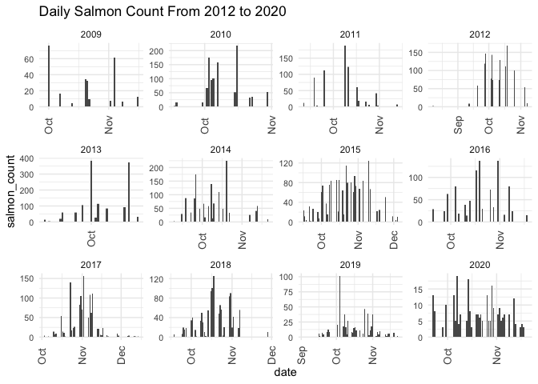<!-- -->

``` r
clean_data %>% 
  filter(is.na(date)==FALSE) %>% 
  mutate(year = year(date)) %>% 
  group_by(year) %>%
  summarise(total_salmon_count = sum(salmon_count, na.rm = T)) %>%
  # glimpse()
  ggplot(aes(x = year, y = total_salmon_count)) + 
  geom_col() +
  theme_minimal() +
  theme(axis.text.x = element_text(size = 10,angle = 90, vjust = 0.5, hjust=0.1)) +
  theme(axis.text.y = element_text(size = 8))+
  labs(title = "Annual Total Salmon Count From 2012 to 2020",
       x = 'Year',
       y = 'Total Salmon Count')
```

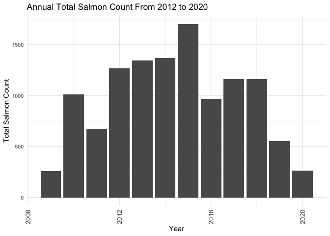<!-- -->

**Numeric Daily Summary of salmon\_count from 2009 to 2020**

``` r
clean_data %>%
  group_by(date) %>%
  summarise(count = sum(salmon_count, na.rm = T)) %>%
  pull(count) %>%
  summary()
```

    ##    Min. 1st Qu.  Median    Mean 3rd Qu.    Max. 
    ##    0.00    6.00   18.00   40.24   61.00  382.00

**NA and Unknown Values**

-   0.004 % of values in the `salmon_count` column are NA.

### Variable:`redd_count`

``` r
clean_data %>% 
  filter(is.na(date)==FALSE) %>% 
  ggplot(aes(x = date, y = redd_count)) + 
  geom_col() +
  facet_wrap(~year(date), scales = "free") +
  scale_x_date(labels = date_format("%b"), date_breaks = "1 month")+
  theme_minimal() +
  theme(axis.text.x = element_text(size = 10,angle = 90, vjust = 0.5, hjust=0.1)) +
  theme(axis.text.y = element_text(size = 8))+
  labs(title = "Daily Redd Count From 2012 to 2020")
```

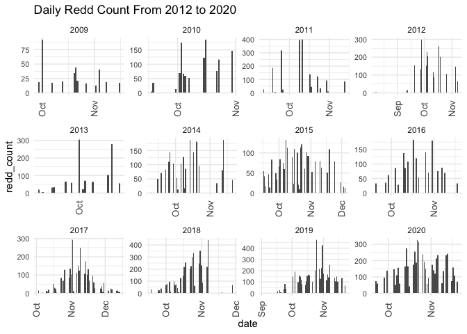<!-- -->

``` r
clean_data %>% 
  filter(is.na(date)==FALSE) %>% 
  mutate(year = year(date)) %>% 
  group_by(year) %>%
  summarise(total_redd_count = sum(redd_count, na.rm = T)) %>%
  # glimpse()
  ggplot(aes(x = year, y = total_redd_count)) + 
  geom_col() +
  theme_minimal() +
  theme(axis.text.x = element_text(size = 10,angle = 90, vjust = 0.5, hjust=0.1)) +
  theme(axis.text.y = element_text(size = 8))+
  labs(title = "Annual Total Redd Count From 2009 to 2020",
       x = 'Year',
       y = 'Total Redd Count')
```

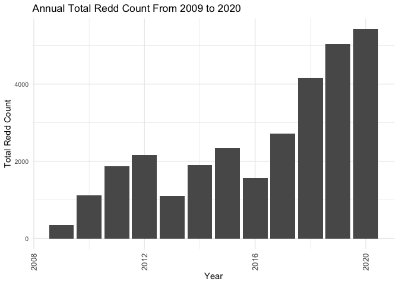<!-- -->

**Numeric Daily Summary of total redd\_count From 2009 to 2020**

``` r
clean_data %>%
  group_by(date) %>%
  summarise(count = sum(redd_count, na.rm = T)) %>%
  pull(count) %>%
  summary()
```

    ##    Min. 1st Qu.  Median    Mean 3rd Qu.    Max. 
    ##     0.0    34.0    82.0   101.3   142.5   471.0

**NA and Unknown Values**

-   0 % of values in the `redd_count` column are NA.

### Variable:`redd_width_m`

``` r
clean_data %>%
  ggplot(aes(x = redd_width_m)) +
  geom_histogram(binwidth = 0.5, color = "black", fill = "grey") +
  scale_x_continuous(breaks = round(seq(min(clean_data$redd_width_m, na.rm = TRUE), max(clean_data$redd_width_m, na.rm = TRUE), by = 0.5),0))+
  labs(title = "Redd Width Distribution")+
  theme_minimal()
```

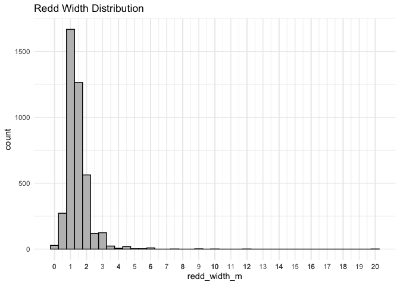<!-- -->

**Numeric Summary of redd\_width\_m from 2009 to 2020**

``` r
summary(clean_data$redd_width_m)
```

    ##    Min. 1st Qu.  Median    Mean 3rd Qu.    Max.    NA's 
    ##   0.000   1.000   1.300   1.427   1.600  20.000   24189

**NA and Unknown Values**

-   85.5 % of values in the `redd_width_m` column are NA.

### Variable: `redd_length_m`

``` r
clean_data %>%
  ggplot(aes(x = redd_length_m)) +
  geom_histogram(binwidth = 0.5, color = "black", fill = "grey") +
  scale_x_continuous(breaks = round(seq(min(clean_data$redd_length_m, na.rm = TRUE), max(clean_data$redd_length_m, na.rm = TRUE), by = 1),1))+
  labs(title = "Redd Length Distribution") +
  theme_minimal()
```

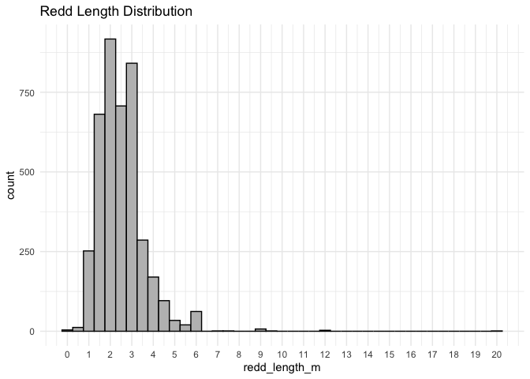<!-- -->

**Numeric Summary of redd\_length\_m 2009 to 2020**

``` r
summary(clean_data$redd_length_m)
```

    ##    Min. 1st Qu.  Median    Mean 3rd Qu.    Max.    NA's 
    ##   0.000   1.800   2.400   2.528   3.050  20.000   24200

**NA and Unknown Values**

-   85.5 % of values in the `redd_length_m` column are NA.

### Physical Attributes

### Variable:`percent_fine_substrate`

``` r
# colourCount = length(unique(cleaner_data_2009$location))
# getPalette = colorRampPalette(brewer.pal(12, "Paired"))
clean_data %>%
  ggplot(aes(x = percent_fine_substrate)) +
  # scale_fill_manual(values = getPalette(colourCount))+
  geom_histogram(binwidth = 5, position = 'stack', color = "black") +
  labs(title = "Percent Fine Substrate Distribution")
```

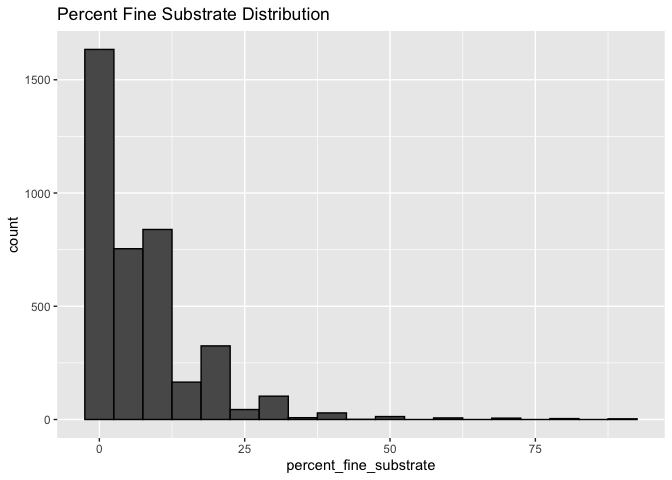<!-- -->

``` r
  # theme(legend.text = element_text(size = 5)) +
  # guides(fill = guide_legend(nrow = 40))
```

**Numeric Summary of percent\_fine\_substrate from 2009 to 2020**

``` r
summary(clean_data$percent_fine_substrate)
```

    ##    Min. 1st Qu.  Median    Mean 3rd Qu.    Max.    NA's 
    ##   0.000   0.000   5.000   7.341  10.000  90.000   24361

**NA and Unknown Values**

-   86.1 % of values in the `percent_fine_substrate` column are NA.

### Variable:`percent_small_substrate`

``` r
clean_data %>%
  ggplot(aes(x = percent_small_substrate)) +
  geom_histogram(binwidth = 10, position = 'stack', color = "black") +
  labs(title = "Percent Small Substrate Distribution")
```

<!-- -->

**Numeric Summary of percent\_small\_substrate from 2009 to 2020**

``` r
summary(clean_data$percent_small_substrate)
```

    ##    Min. 1st Qu.  Median    Mean 3rd Qu.    Max.    NA's 
    ##    0.00   20.00   30.00   31.55   40.00   90.00   24356

**NA and Unknown Values**

-   86.1 % of values in the `percent_small_substrate` column are NA.

### Variable:`percent_medium_substrate`

``` r
clean_data %>%
  ggplot(aes(x = percent_medium_substrate)) +
  geom_histogram(binwidth = 10, position = 'stack', color = "black") +
  labs(title = "Percent Medium Substrate Distribution")
```

<!-- -->

**Numeric Summary of percent\_medium\_substrate from 2009 to 2020**

``` r
summary(clean_data$percent_medium_substrate)
```

    ##    Min. 1st Qu.  Median    Mean 3rd Qu.    Max.    NA's 
    ##    0.00   30.00   40.00   40.91   50.00   95.00   24354

**NA and Unknown Values**

-   86.1 % of values in the `percent_medium_substrate` column are NA.

### Variable:`percent_large_substrate`

``` r
clean_data %>%
  ggplot(aes(x = percent_large_substrate)) +
  geom_histogram(binwidth = 10, position = 'stack', color = "black") +
  labs(title = "Percent Large Substrate Distribution")
```

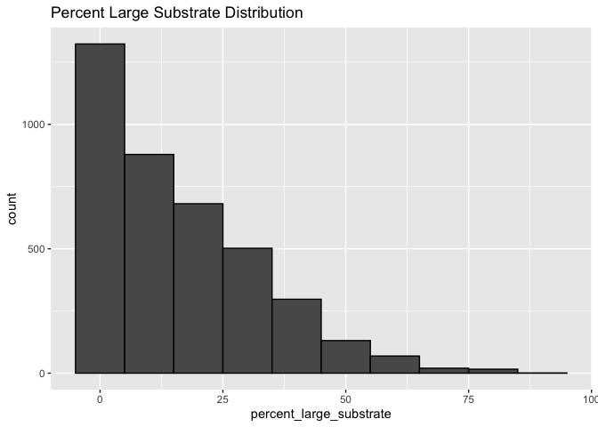<!-- -->

**Numeric Summary of percent\_large\_substrate from 2009 to 2020**

``` r
summary(clean_data$percent_large_substrate)
```

    ##    Min. 1st Qu.  Median    Mean 3rd Qu.    Max.    NA's 
    ##    0.00    0.00   10.00   17.04   30.00   90.00   24377

**NA and Unknown Values**

-   86.1 % of values in the `percent_large_substrate` column are NA.

### Variable:`percent_boulder`

``` r
clean_data %>%
  ggplot(aes(x = percent_boulder)) +
  geom_histogram(binwidth = 7, position = 'stack', color = "black") +
  labs(title = "Percent Boulder Distribution")
```

<!-- -->

**Numeric Summary of percent\_boulder from 2009 to 2020**

``` r
summary(clean_data$percent_boulder)
```

    ##    Min. 1st Qu.  Median    Mean 3rd Qu.    Max.    NA's 
    ##   0.000   0.000   0.000   3.253   0.000  70.000   24415

**NA and Unknown Values**

-   86.3 % of values in the `percent_large_substrate` column are NA.

### Summary of Mean Percent Substrate In Each Location

``` r
clean_data %>% 
  group_by(location) %>% 
  summarise(mean_percent_fine_substrate = mean(percent_fine_substrate, na.rm = TRUE),
            mean_percent_small_substrate = mean(percent_small_substrate, na.rm = TRUE),
            mean_percent_medium_substrate = mean(percent_medium_substrate, na.rm = TRUE),
            mean_percent_large_substrate = mean(percent_large_substrate, na.rm = TRUE),
            mean_percent_boulder = mean(percent_boulder, na.rm = TRUE),
            ) %>% 
  pivot_longer(
    cols = starts_with("mean"),
    names_to = "substrate_type",
    values_to = "percent",
    values_drop_na = TRUE
  ) %>%
  ggplot(aes(fill = substrate_type,
             y = location,
             x = percent))+
  geom_bar(position = 'stack', stat = 'identity', color = 'black')+
  labs(title = "Mean Percent Substrate by Location")+
  theme(axis.text=element_text(size = 7))
```

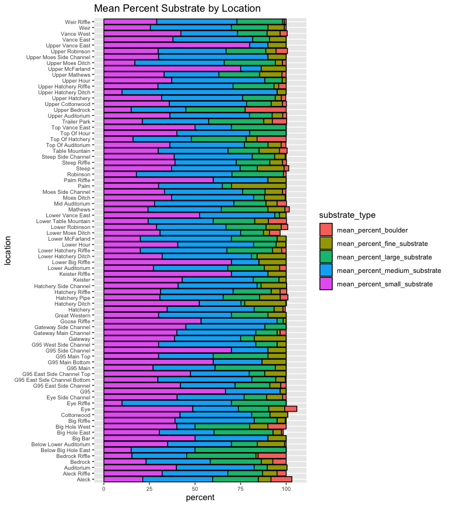<!-- -->

### Variable: `depth_m`

``` r
clean_data %>%
  ggplot(aes(x = depth_m)) +
  geom_histogram(binwidth = 0.15, position = 'stack', color = "black") +
  labs(title = "Depth Distribution")
```

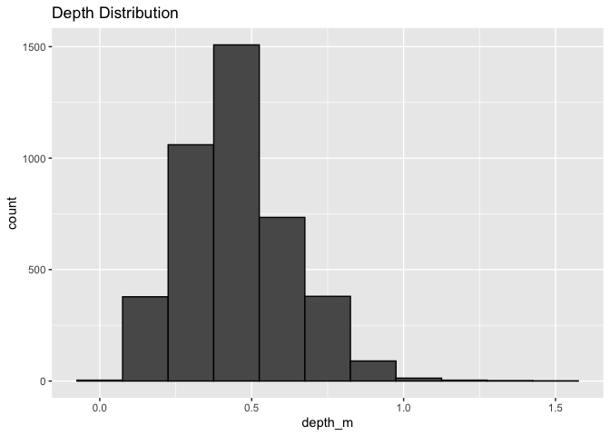<!-- -->

**Numeric Summary of depth\_m from 2009 to 2020**

``` r
summary(clean_data$depth_m)
```

    ##    Min. 1st Qu.  Median    Mean 3rd Qu.    Max.    NA's 
    ##   0.020   0.320   0.440   0.454   0.560   1.500   24122

**NA and Unknown Values**

-   85.2 % of values in the `depth_m` column are NA.

### Variable: `pot_depth_m`

``` r
clean_data %>%
  filter(pot_depth_m < 40) %>% #removed two values for better view of distribution
  ggplot(aes(x = pot_depth_m)) +
  geom_histogram(binwidth = 0.15, position = 'stack', color = "black") +
  labs(title = "Pot Depth Distribution")
```

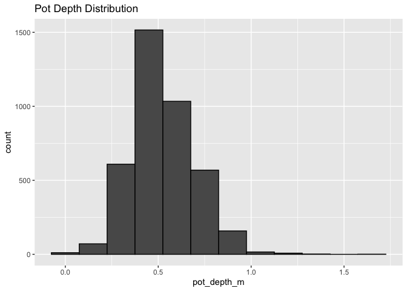<!-- -->

**Numeric Summary of pot\_depth\_m from 2009 to 2020**

``` r
summary(clean_data$pot_depth_m)
```

    ##    Min. 1st Qu.  Median    Mean 3rd Qu.    Max.    NA's 
    ##   0.000   0.400   0.500   0.547   0.620  50.000   24299

**NA and Unknown Values**

-   85.9 % of values in the `pot_depth_m` column are NA.

### Variable: `velocity`

Standardize by converting to ft/s

``` r
clean_data$velocity <- clean_data$velocity*3.28084
```

``` r
clean_data %>%
  ggplot(aes(x = velocity)) +
  geom_histogram(binwidth = 0.2, position = 'stack', color = "black") +
  labs(title = "Velocity Distribution")
```

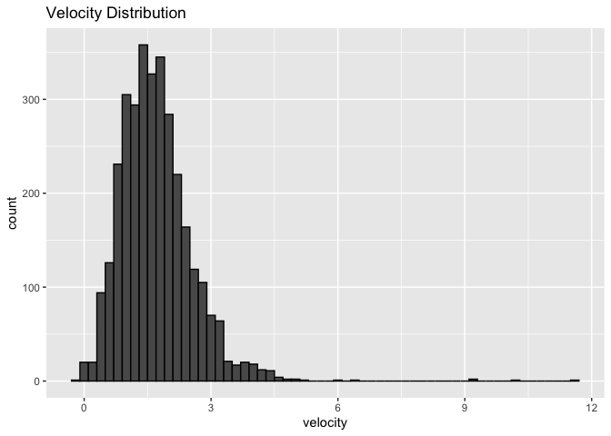<!-- -->

**Numeric Summary of velocity\_m\_per\_s from 2009 to 2020**

``` r
summary(clean_data$velocity)
```

    ##    Min. 1st Qu.  Median    Mean 3rd Qu.    Max.    NA's 
    ##  -0.131   1.115   1.575   1.698   2.133  11.516   25035

**NA and Unknown Values**

-   88.5 % of values in the `velocity` column are NA.

### Variable: `latitude and longitude`

**Numeric Summary of latitude from 2009 to 2020**

``` r
summary(clean_data$latitude)
```

    ##    Min. 1st Qu.  Median    Mean 3rd Qu.    Max.    NA's 
    ##  392225 4374974 4375010 3997639 4375053 4394990   18818

**Numeric Summary of longitude from 2009 to 2020**

``` r
summary(clean_data$longitude)
```

    ##    Min. 1st Qu.  Median    Mean 3rd Qu.    Max.    NA's 
    ##  617030  623786  624022  682158  624240 6245105   18817

### Notes and Issues:

-   latitude and longitude were not converted to WGS84
-   2012,2013,2015 latitude and longitude shows inconsistencies and
    large variations (refer to specific year Markdown for more info)

## Next steps

-   Most important variables for the JPE are `date`, `latitude`,
    `longitude`, `type`, `redd_count`, `salmon_count`

### Add cleaned data back onto google cloud

``` r
feather_redd_survey <- clean_data %>% glimpse()
```

    ## Rows: 28,296
    ## Columns: 17
    ## $ date                     <date> 2009-09-29, 2009-09-29, 2009-09-29, 2009-09-…
    ## $ location                 <chr> "Table Mountain", "Table Mountain", "Table Mo…
    ## $ type                     <chr> "Area", "Point", "Area", "Area", "Area", "Are…
    ## $ redd_count               <int> 1, 1, 1, 1, 1, 1, 1, 3, 1, 1, 1, 1, 1, 1, 1, …
    ## $ salmon_count             <int> 0, 0, 0, 0, 0, 0, 0, 0, 0, 0, 0, 0, 0, 0, 0, …
    ## $ depth_m                  <dbl> 0.78, 0.56, 0.64, 0.50, 0.40, 0.52, 0.58, 0.3…
    ## $ pot_depth_m              <dbl> 0.00, 0.00, 0.00, 0.00, 0.00, 0.00, 0.00, 0.0…
    ## $ velocity                 <dbl> 0.000000, 0.000000, 0.000000, 0.000000, 0.000…
    ## $ percent_fine_substrate   <dbl> 10, 5, 15, 30, 25, 5, 5, 20, NA, NA, NA, NA, …
    ## $ percent_small_substrate  <dbl> 20, 20, 30, 50, 15, 15, 20, 20, NA, NA, NA, N…
    ## $ percent_medium_substrate <dbl> 40, 30, 20, 20, 60, 30, 20, 60, NA, NA, NA, N…
    ## $ percent_large_substrate  <int> 30, 40, 30, 0, 0, 50, 45, 0, NA, NA, NA, NA, …
    ## $ percent_boulder          <int> 0, 5, 5, 0, 0, 0, 0, 0, NA, NA, NA, NA, NA, N…
    ## $ redd_width_m             <dbl> NA, 0.91, 0.91, 0.91, 1.22, 0.91, 0.91, 3.66,…
    ## $ redd_length_m            <dbl> NA, 1.22, 1.52, 1.22, 1.83, 0.91, 0.91, 1.22,…
    ## $ latitude                 <dbl> NA, NA, NA, NA, NA, NA, NA, NA, NA, NA, NA, N…
    ## $ longitude                <dbl> NA, NA, NA, NA, NA, NA, NA, NA, NA, NA, NA, N…

``` r
f <- function(input, output) write_csv(input, file = output)

gcs_upload(feather_redd_survey,
           object_function = f,
           type = "csv",
           name = "adult-holding-redd-and-carcass-surveys/feather-river/data/feather_redd.csv")
```
