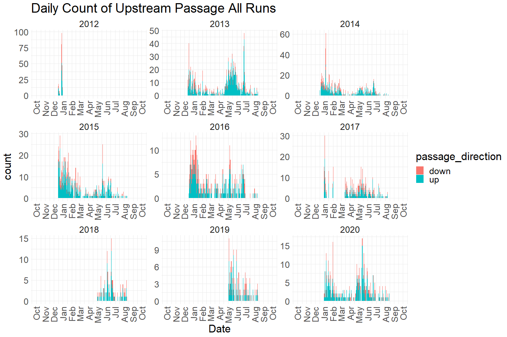
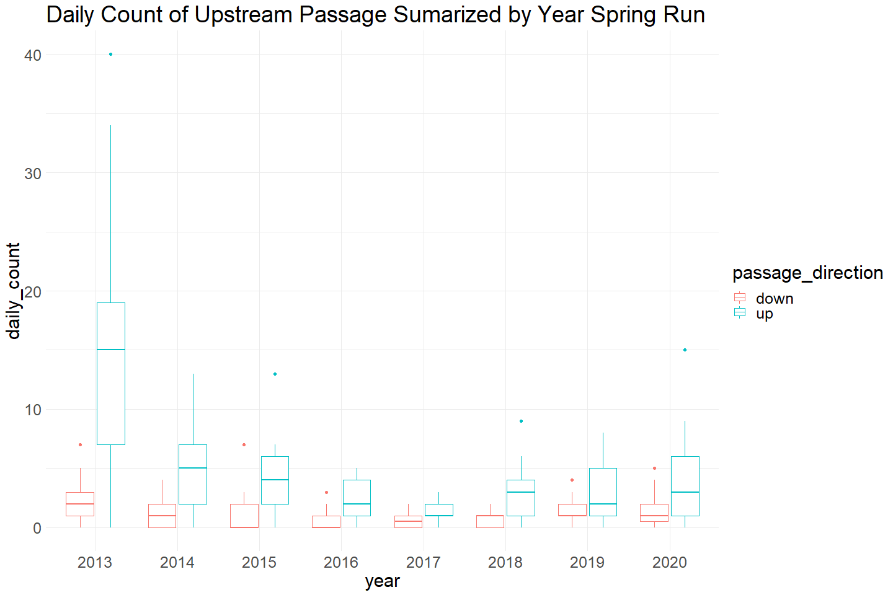
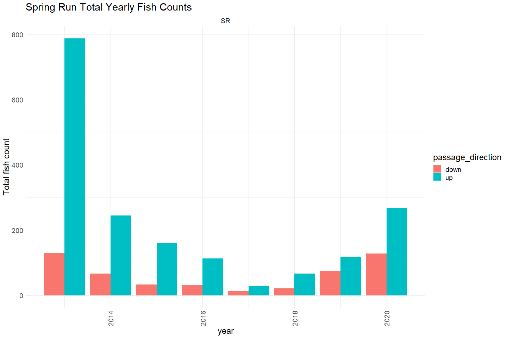

Clear Creek Adult Upstream Video Data QC Checklist
================
Erin Cain
9/29/2021

# Clear Creek Adult Upstream Video Data

## Description of Monitoring Data

**Data type** Raw passage counts

**Timeframe:** 2013-2020

**Video Season:** August through December

**Completeness of Record throughout timeframe:** Data are not padded -
missing data indicate a period where footage was not collected by USFWS

**Sampling Location:** Located at the mouth of clear creek

**Data Contact:** [Sam Provins](mailto:samuel_provins@fws.gov)

Additional information describing this monitoring data is available in
the [Adult Spring Run Chinook Salmon Monitoring in Clear Creek
Report](https://www.fws.gov/redbluff/CC%20BC/Clear%20Creek%20Monitoring%20Final%20Reports/2013-2018%20Clear%20Creek%20Adult%20Spring-run%20Chinook%20Salmon%20Monitoring.pdf)
prepared by USFWS.

## Access Cloud Data

``` r
# Run Sys.setenv() to specify GCS_AUTH_FILE and GCS_DEFAULT_BUCKET before running 
# getwd()
# Open object from google cloud storage
# Set your authentication using gcs_auth
gcs_auth(json_file = Sys.getenv("GCS_AUTH_FILE"))
# Set global bucket 
gcs_global_bucket(bucket = Sys.getenv("GCS_DEFAULT_BUCKET"))

# git data and save as xlsx
gcs_get_object(object_name = 
                 "adult-upstream-passage-monitoring/clear-creek/data-raw/ClearCreekVideoWeir_AdultRecruitment_2013-2020.xlsx",
               bucket = gcs_get_global_bucket(),
               saveToDisk = "raw_clear_creek_passage_data.xlsx",
               overwrite = TRUE)
```

Read in data from google cloud, glimpse raw data and domain description
sheet:

``` r
# read in data to clean 
sheets <- readxl::excel_sheets("raw_clear_creek_passage_data.xlsx")
domain_description <- readxl::read_excel("raw_clear_creek_passage_data.xlsx", 
                                         sheet = "Domain Description") 
domain_description %>% head(10)
```

    ## # A tibble: 10 x 2
    ##    Domain            Description                                                
    ##    <chr>             <chr>                                                      
    ##  1 DATE              "XX/XX/XXXX Date of the day watched, (neccessary for when ~
    ##  2 TIME BLOCK START  "Use military time-Top of the hour or half hour through 29~
    ##  3 VIEWING CONDITION "Viewing Conditions: 0=Normal (good visibility, clear wate~
    ##  4 SPECIES           "Choose from drop down list. If nothing passed in the half~
    ##  5 UP                "Total passing up and down of the white plate. Use individ~
    ##  6 DOWN               <NA>                                                      
    ##  7 TIME              "HH:MM:SS. Use specific time for all Salmon, Steelhead/tro~
    ##  8 ADIPOSE           "Salmon and trout only. Partial clipped adipose fins are c~
    ##  9 SEX               "Salmon and trout only."                                   
    ## 10 JACKSIZE          "Salmon only (Fork Length less than 22\"). Total width of ~

``` r
raw_video_data <- readxl::read_excel("raw_clear_creek_passage_data.xlsx", 
                                     sheet = "ClearCreekVideoWeir_AdultRecrui",
                                     col_types = c("numeric", "date", "date", 
                                                   "text", "text", "numeric", 
                                                   "numeric", "date", "text",
                                                   "text", "text", "text", 
                                                   "text", "text")) %>% 
  glimpse()
```

    ## Rows: 99,996
    ## Columns: 14
    ## $ Video_Year         <dbl> 13, 13, 13, 13, 13, 13, 13, 13, 13, 13, 13, 13, 13,~
    ## $ Date               <dttm> 2012-12-17, 2012-12-17, 2012-12-17, 2012-12-17, 20~
    ## $ Time_Block         <dttm> 1899-12-31 10:30:00, 1899-12-31 11:00:00, 1899-12-~
    ## $ Viewing_Condition  <chr> "1", "1", "1", "1", "1", "1", "1", "1", "1", "1", "~
    ## $ Species            <chr> "NONE", "NONE", "NONE", "NONE", "NONE", "NONE", "CH~
    ## $ Up                 <dbl> 0, 0, 0, 0, 0, 0, 1, 1, 0, 1, 0, 1, 1, 0, 0, 0, 1, ~
    ## $ Down               <dbl> 0, 0, 0, 0, 0, 0, 0, 0, 0, 0, 0, 0, 0, 0, 1, 0, 0, ~
    ## $ Time_Passed        <dttm> NA, NA, NA, NA, NA, NA, 1899-12-31 13:46:00, 1899-~
    ## $ Adipose            <chr> NA, NA, NA, NA, NA, NA, "PRESENT", "PRESENT", NA, "~
    ## $ Sex                <chr> NA, NA, NA, NA, NA, NA, "MALE", "UNK", NA, "UNK", N~
    ## $ Spawning_Condition <chr> NA, NA, NA, NA, NA, NA, "3", "3", NA, "3", NA, "3",~
    ## $ Jack_Size          <chr> NA, NA, NA, NA, NA, NA, "NO", "NO", NA, "UNK", NA, ~
    ## $ Run                <chr> NA, NA, NA, NA, NA, NA, "LF", "LF", NA, NA, NA, NA,~
    ## $ STT_Size           <chr> NA, NA, NA, NA, NA, NA, NA, NA, NA, ">16", NA, ">16~

## Data transformations

We cleaned up the column names and removed an unneeded and redundant
columns.

``` r
cleaner_video_data <- raw_video_data %>% 
  set_names(tolower(colnames(raw_video_data))) %>%
  mutate(date = as.Date(date),
         time_block = hms::as_hms(time_block),
         time_passed = hms::as_hms(time_passed)) %>%
  filter(species == "CHN") %>%
  select(-stt_size, -video_year, -species) %>% 
  pivot_longer(!c(date:viewing_condition, time_passed:run), 
               names_to = "passage_direction",
               values_to = "count") %>%
  glimpse() 
```

    ## Rows: 12,054
    ## Columns: 11
    ## $ date               <date> 2012-12-17, 2012-12-17, 2012-12-17, 2012-12-17, 20~
    ## $ time_block         <time> 13:30:00, 13:30:00, 15:30:00, 15:30:00, 18:00:00, ~
    ## $ viewing_condition  <chr> "1", "1", "1", "1", "1", "1", "1", "1", "1", "1", "~
    ## $ time_passed        <time> 13:46:00, 13:46:00, 15:37:00, 15:37:00, 18:19:00, ~
    ## $ adipose            <chr> "PRESENT", "PRESENT", "PRESENT", "PRESENT", "UNK", ~
    ## $ sex                <chr> "MALE", "MALE", "UNK", "UNK", "FEMALE", "FEMALE", "~
    ## $ spawning_condition <chr> "3", "3", "3", "3", "3", "3", "3", "3", "3", "3", "~
    ## $ jack_size          <chr> "NO", "NO", "NO", "NO", "NO", "NO", "NO", "NO", "NO~
    ## $ run                <chr> "LF", "LF", "LF", "LF", "LF", "LF", "LF", "LF", "LF~
    ## $ passage_direction  <chr> "up", "down", "up", "down", "up", "down", "up", "do~
    ## $ count              <dbl> 1, 0, 1, 0, 1, 0, 1, 0, 1, 0, 1, 0, 1, 0, 1, 0, 1, ~

## Data Dictionary

The following table describes the variables included in this dataset and
the percent that do not include data.

``` r
percent_na <- cleaner_video_data %>%
  summarise_all(list(name = ~sum(is.na(.))/length(.))) %>%
  pivot_longer(cols = everything())
  
data_dictionary <- tibble(variables = colnames(cleaner_video_data),
                          description = c("Date",
                                          "Time block - Use military time-Top of the hour or half hour through 29th or 59th minute. Example 00:00 = (00:00:00 through 00:29:59) and 15:30= (15:30:00 through 15:59:59)",
                                          "Viewing condition",
                                          "HH:MM:SS. Use specific time for all Salmon, Steelhead/trout/lamprey/Unk salmonid/Unk other fish.",
                                          "Adipose present or not",
                                          "Sex of the fish",
                                          "Describes fish condition as it relates to spawning",
                                          "Whether or not the total width of Jack plate is 22 inch",
                                          "Run of the fish",
                                          "Whether fish is moving upstream or downstream",
                                          "Passage count"),
                          percent_na = round(percent_na$value*100)
                          
)
knitr::kable(data_dictionary)
```

| variables           | description                                                                                                                                                                 | percent\_na |
|:--------------------|:----------------------------------------------------------------------------------------------------------------------------------------------------------------------------|------------:|
| date                | Date                                                                                                                                                                        |           0 |
| time\_block         | Time block - Use military time-Top of the hour or half hour through 29th or 59th minute. Example 00:00 = (00:00:00 through 00:29:59) and 15:30= (15:30:00 through 15:59:59) |           0 |
| viewing\_condition  | Viewing condition                                                                                                                                                           |           0 |
| time\_passed        | HH:MM:SS. Use specific time for all Salmon, Steelhead/trout/lamprey/Unk salmonid/Unk other fish.                                                                            |           0 |
| adipose             | Adipose present or not                                                                                                                                                      |           0 |
| sex                 | Sex of the fish                                                                                                                                                             |           0 |
| spawning\_condition | Describes fish condition as it relates to spawning                                                                                                                          |          22 |
| jack\_size          | Whether or not the total width of Jack plate is 22 inch                                                                                                                     |           1 |
| run                 | Run of the fish                                                                                                                                                             |          21 |
| passage\_direction  | Whether fish is moving upstream or downstream                                                                                                                               |           0 |
| count               | Passage count                                                                                                                                                               |           0 |

## Explore Numeric Variables:

``` r
cleaner_video_data %>% select_if(is.numeric) %>% colnames()
```

    ## [1] "count"

### Variable: `count`

**Plotting Passage Counts Moving Up over Period of Record**

``` r
cleaner_video_data %>% 
  mutate(year = as.factor(year(date)),
         fake_year = if_else(month(date) %in% 10:12, 1900, 1901),
         fake_date = as.Date(paste0(fake_year,"-", month(date), "-", day(date)))) %>%
  ggplot(aes(x = fake_date, y = count, fill = passage_direction)) + 
  geom_col() + 
  facet_wrap(~year(date), scales = "free") + 
  scale_x_date(labels = date_format("%b"), limits = c(as.Date("1900-10-01"), as.Date("1901-10-01")), date_breaks = "1 month") + 
  theme_minimal() + 
  theme(text = element_text(size = 23),
        axis.text.x = element_text(angle = 90, vjust = 0.5, hjust=1)) + 
  labs(title = "Daily Count of Upstream Passage All Runs", 
       x = "Date")  
```

<!-- -->

``` r
cleaner_video_data %>% 
  filter(run == "SR") %>%
  ggplot(aes(x = date, y = count, fill = passage_direction)) + 
  geom_col() + 
  facet_wrap(~year(date), scales = "free") + 
  scale_x_date(labels = date_format("%b"), date_breaks = "1 month") + 
  theme_minimal() + 
  theme(text = element_text(size = 23),
        axis.text.x = element_text(angle = 90, vjust = 0.5, hjust=1)) + 
  labs(title = "Spring Run Daily Count Upstream Passage", 
       x = "Date")  
```

<!-- -->

Spring Run Chinook appear to be seen moving upstream April through
August.

``` r
# Boxplots of daily counts by year
cleaner_video_data %>% group_by(date, passage_direction) %>%
  filter(run == "SR") %>% 
  mutate(daily_count = sum(count)) %>%
  mutate(year = as.factor(year(date))) %>% 
  ungroup() %>%
  ggplot(aes(x = year, y = daily_count, color = passage_direction)) + 
  geom_boxplot() + 
  theme_minimal() +
  theme(text = element_text(size = 23)) + 
  labs(title = "Daily Count of Upstream Passage Sumarized by Year Spring Run") 
```

<!-- -->

``` r
cleaner_video_data  %>%
  mutate(year = as.factor(year(date))) %>%
  filter(run == "SR") %>% # Filter to only show runs that have more than one data point and are not NA/Unknown
  group_by(year = year(date), passage_direction, run) %>%
  summarise(total_catch = sum(count)) %>%
  ggplot(aes(x = year, y = total_catch, fill = passage_direction)) + 
  geom_col(position = "dodge") + 
  theme_minimal() +
  labs(title = "Spring Run Total Yearly Fish Counts",
       y = "Total fish count") + 
  theme(text = element_text(size = 18),
        axis.text.x = element_text(angle = 90, vjust = 0.5, hjust=1)) + 
  facet_grid(~run)
```

    ## `summarise()` has grouped output by 'year', 'passage_direction'. You can override using the `.groups` argument.

<!-- -->

Total passage up = total passage down every year

**Numeric Summary of Passage Counts Moving Up over Period of Record**

``` r
# Table with summary statistics
summary(cleaner_video_data$count)
```

    ##    Min. 1st Qu.  Median    Mean 3rd Qu.    Max. 
    ##  0.0000  0.0000  0.0000  0.4991  1.0000  2.0000

``` r
# daily numeric summary 
cleaner_video_data %>% group_by(date) %>%
  summarise(count = sum(count, na.rm = T)) %>%
  pull(count) %>%
  summary()
```

    ##    Min. 1st Qu.  Median    Mean 3rd Qu.    Max. 
    ##     1.0     1.0     3.0     5.3     7.0    98.0

**NA and Unknown Values**

-   0 % of values in the `count` column are NA. However, there are
    clearly gaps in data. More investigation needs to be done to see if
    0 is a real 0 or if it can be explained by other factors (outages).

## Explore Categorical variables:

``` r
# Filter for coltypes that are characters
cleaner_video_data %>% select_if(is.character) %>% colnames()
```

    ## [1] "viewing_condition"  "adipose"            "sex"               
    ## [4] "spawning_condition" "jack_size"          "run"               
    ## [7] "passage_direction"

### Variable: `viewing_condition`

``` r
table(cleaner_video_data$viewing_condition) 
```

    ## 
    ##    0    1    2    3 
    ## 9040 2776  232    6

**Create lookup rda for viewing condition encoding:**

``` r
# View description of domain for viewing condition 
description <- domain_description[which(domain_description$Domain == "VIEWING CONDITION"), ]$Description
clear_passage_viewing_condition <- 0:3
names(clear_passage_viewing_condition) <- c(
  "Normal (good visability, clear water, all equiptment working, no obstructions)", 
  "Readable (lower confidence due to turbidity or partial loss of video equiptment)", 
  "Not Readable (high turbidity or equiptment failure)",
  "Weir is flooded")

# write_rds(clear_passage_viewing_condition, "../../data/clear_passage_viewing_condition.rds")

tibble(code = clear_passage_viewing_condition, 
       definitions = names(clear_passage_viewing_condition))
```

    ## # A tibble: 4 x 2
    ##    code definitions                                                             
    ##   <int> <chr>                                                                   
    ## 1     0 Normal (good visability, clear water, all equiptment working, no obstru~
    ## 2     1 Readable (lower confidence due to turbidity or partial loss of video eq~
    ## 3     2 Not Readable (high turbidity or equiptment failure)                     
    ## 4     3 Weir is flooded

**NA and Unknown Values**

-   0 % of values in the `viewing_condition` column are NA.
-   1.9 % of values in the `viewing_condition` column are considered Not
    Readable because of high turbidity or equipment failure.

### Variable: `adipose`

``` r
table(cleaner_video_data$adipose) 
```

    ## 
    ##  Absent  ABSENT Present PRESENT     UNK UNKNOWN 
    ##      30    2012       6    5786    3710     488

``` r
description <- domain_description[which(domain_description$Domain == "ADIPOSE"), ]$Description
```

Fix inconsistencies with spelling, capitalization, and abbreviations.

``` r
# Fix yes/no/unknown
cleaner_video_data$adipose = tolower(if_else(cleaner_video_data$adipose == "UNK", "unknown", cleaner_video_data$adipose))
```

**NA or Unknown Values**

-   0.2 % of values in the `adipose` column are NA.
-   34.8 % of values in the `adipose` column are`unknown`.

### Variable: `sex`

``` r
table(cleaner_video_data$sex) 
```

    ## 
    ##  Female  FEMALE    Male    MALE     UNK UNKNOWN 
    ##       6    1250      30    3738    5934    1076

Fix inconsistencies with spelling, capitalization, and abbreviations.

``` r
# Fix yes/no/unknown
cleaner_video_data$sex = tolower(if_else(cleaner_video_data$sex == "UNK", "unknown", cleaner_video_data$sex))
```

**NA or Unknown Values**

-   0.2 % of values in the `sex` column are NA.
-   58.2 % of values in the `sex` column are`unknown`.

### Variable: `spawning_condition`

Describes fish condition as it relates to spawning.

``` r
table(cleaner_video_data$spawning_condition)
```

    ## 
    ##    1    2    3    4    5 
    ## 4220  986 2580  446 1122

**Create lookup rda for spawning condition encoding:**

``` r
# View description of domain for viewing condition 
description <- domain_description[which(domain_description$Domain == "SPAWNING CONDITION"), ]$Description
clear_passage_spawning_condition <- c(1:5)
names(clear_passage_spawning_condition) <- c(
  "Energetic; bright or silvery; no spawning coloration or developed secondary sex characteristics.",
  "Energetic, can tell sex from secondary characteristics (kype) silvery or bright coloration but may have some hint of spawning colors.",
  "Spawning colors, defined kype, some tail wear or small amounts of fungus.",
  "Fungus, lethargic, wandering; “ Zombie fish”. Significant tail wear in females to indicate the spawning process has already occurred.",
  "Unable to make distinction.")

# write_rds(clear_passage_spawning_condition, "../../data/clear_passage_spawning_condition.rds")

tibble(code = clear_passage_spawning_condition, 
       definitions = names(clear_passage_spawning_condition))
```

    ## # A tibble: 5 x 2
    ##    code definitions                                                             
    ##   <int> <chr>                                                                   
    ## 1     1 Energetic; bright or silvery; no spawning coloration or developed secon~
    ## 2     2 Energetic, can tell sex from secondary characteristics (kype) silvery o~
    ## 3     3 Spawning colors, defined kype, some tail wear or small amounts of fungu~
    ## 4     4 Fungus, lethargic, wandering; “ Zombie fish”. Significant tail wear in ~
    ## 5     5 Unable to make distinction.

**NA or Unknown Values**

-   22.4 % of values in the `spawning_condition` column are NA.

-   9.3 % of values in the `spawning_condition` column are considered
    Unknown.

### Variable: `jack_size`

Whether or not the total width of Jack plate is 22".

``` r
table(cleaner_video_data$jack_size) 
```

    ## 
    ##    No    NO   UNK   Yes   YES 
    ##    50 10308    82     4  1464

``` r
description <- domain_description[which(domain_description$Domain == "JACKSIZE"), ]$Description
```

Fix inconsistencies with spelling, capitalization, and abbreviations.

``` r
# Fix yes/no/unknown
cleaner_video_data$jack_size = tolower(if_else(cleaner_video_data$jack_size == "UNK", "unknown", cleaner_video_data$jack_size))
```

**NA or Unknown Values**

-   1.2 % of values in the `jack_size` column are NA.
-   0.7 % of values in the `jack_size` column are`unknown`.

### Variable: `run`

``` r
table(cleaner_video_data$run) 
```

    ## 
    ##   FR   LF   SR  UNK   WR 
    ##    2 3658 4558  150 1114

``` r
# description <- domain_description[which(domain_description$Domain == "Run"), ]$Description
```

Fix inconsistencies with spelling, capitalization, and abbreviations.

``` r
# Fix yes/no/unknown
cleaner_video_data$run = if_else(cleaner_video_data$run == "UNK", "unknown", cleaner_video_data$run)
```

**NA or Unknown Values**

-   21.3 % of values in the `run` column are NA.
-   1.2 % of values in the `run` column are`unknown`.

### Variable: `passage_direction`

``` r
table(cleaner_video_data$passage_direction) 
```

    ## 
    ## down   up 
    ## 6027 6027

**NA or Unknown Values**

-   0 % of values in the `passage_direction` column are NA.

## Next Steps:

-   Identify if these columns fit with upstream passage data schema

``` r
clear_passage <- cleaner_video_data %>% 
  glimpse()
```

    ## Rows: 12,054
    ## Columns: 11
    ## $ date               <date> 2012-12-17, 2012-12-17, 2012-12-17, 2012-12-17, 20~
    ## $ time_block         <time> 13:30:00, 13:30:00, 15:30:00, 15:30:00, 18:00:00, ~
    ## $ viewing_condition  <chr> "1", "1", "1", "1", "1", "1", "1", "1", "1", "1", "~
    ## $ time_passed        <time> 13:46:00, 13:46:00, 15:37:00, 15:37:00, 18:19:00, ~
    ## $ adipose            <chr> "present", "present", "present", "present", "unknow~
    ## $ sex                <chr> "male", "male", "unknown", "unknown", "female", "fe~
    ## $ spawning_condition <chr> "3", "3", "3", "3", "3", "3", "3", "3", "3", "3", "~
    ## $ jack_size          <chr> "no", "no", "no", "no", "no", "no", "no", "no", "no~
    ## $ run                <chr> "LF", "LF", "LF", "LF", "LF", "LF", "LF", "LF", "LF~
    ## $ passage_direction  <chr> "up", "down", "up", "down", "up", "down", "up", "do~
    ## $ count              <dbl> 1, 0, 1, 0, 1, 0, 1, 0, 1, 0, 1, 0, 1, 0, 1, 0, 1, ~

### Save cleaned data back to google cloud

``` r
f <- function(input, output) write_csv(input, file = output)

gcs_upload(clear_passage,
           object_function = f,
           type = "csv",
           name = "adult-upstream-passage-monitoring/clear-creek/data/clear_passage.csv")
```
