Battle and Clear Creek data from EDI
================
ashley
1/17/2024

This script pulls data from EDI for Battle and Clear creeks. Previously
data had been provided in another format. FlowWest then worked with
USFWS (Natasha Wingerter and Mike Schraml) to prepare an EDI data
package. We believe the data on EDI are more complete and robust than
the data previously provided. This script is replacing the Battle and
Clear RST QC markdowns.

# Catch

``` r
# TODO what is subsample? should i include? 
# TODO what is powerhous battle?
# TODO should the NA counts be 0s? These likely have been estimated and have values for r_catch. Should we use r_catch?
# TODO there is no adipose_clipped or hatchery variable in the data

catch_format <- catch |> 
  select(sample_date, station_code, count, fork_length, weight, fws_run, interp, common_name, life_stage) |> 
  rename(date = sample_date,
         site = station_code,
         run = fws_run,
         interpolated = interp,
         species = common_name,
         lifestage = life_stage) |> 
  mutate(stream = case_when(grepl("clear", site) ~ "clear creek",
                            grepl("battle", site) ~ "battle creek"),
         site = case_when(site == "upper battle creek" ~ "ubc",
                          site == "lower battle creek" ~ "lbc",
                          site == "lower clear creek" ~ "lcc", 
                          site == "upper clear creek" ~ "ucc"),
         subsite = site,
         species = tolower(species),
         lifestage = case_when(lifestage == "not provided" ~ "not recorded",
                               lifestage == "obvious fry" ~ "fry",
                               T ~ lifestage),
         run = case_when(is.na(run) & count > 0 ~ "not recorded",
                         T ~ run))
```

## QA/QC

### run

``` r
unique(catch_format$run)
```

    ## [1] "not recorded" "fall"         "winter"       "spring"       "late-fall"   
    ## [6] NA

``` r
total_count <- catch_format %>%
  mutate(year = year(date)) %>%
  group_by(site, year) %>%
  summarize(total = sum(count, na.rm = T))
```

    ## `summarise()` has grouped output by 'site'. You can override using the
    ## `.groups` argument.

``` r
catch_format %>%
  mutate(year = year(date)) %>%
  group_by(site, year, run) %>%
  summarize(count = sum(count, na.rm = T)) %>%
  left_join(total_count) %>%
  mutate(percent = (count/total)*100) %>%
  ggplot(aes(x = year, y = percent, fill = run)) +
  geom_col() +
  facet_wrap(~site, scales = "free_y") +
  theme_minimal() +
  theme(legend.position = "bottom")
```

    ## `summarise()` has grouped output by 'site', 'year'. You can override using the
    ## `.groups` argument.
    ## Joining with `by = join_by(site, year)`

<!-- -->

### fork_length

Figure below shows the percent of total fish counted that have a fork
length measurement.

``` r
catch_format %>%
  filter(!is.na(fork_length)) %>%
  mutate(year = year(date)) %>%
  group_by(site, year) %>%
  summarize(count = sum(count, na.rm = T)) %>%
  left_join(total_count) %>%
  mutate(percent = (count/total)*100) %>%
  ggplot(aes(x = year, y = percent)) +
  geom_col() +
  facet_wrap(~site)
```

    ## `summarise()` has grouped output by 'site'. You can override using the
    ## `.groups` argument.
    ## Joining with `by = join_by(site, year)`

<!-- -->

### lifestage

Figure below shows the percentage by lifestage for each tributary and
year.

``` r
catch_format %>%
  mutate(year = year(date)) %>%
  group_by(site, year, lifestage) %>%
  summarize(count = sum(count, na.rm = T)) %>%
  left_join(total_count) %>%
  mutate(percent = (count/total)*100) %>%
  ggplot(aes(x = year, y = percent, fill = lifestage)) +
  geom_col() +
  facet_wrap(~site, scales = "free_y") +
  theme_minimal() +
  theme(legend.position = "bottom")
```

    ## `summarise()` has grouped output by 'site', 'year'. You can override using the
    ## `.groups` argument.
    ## Joining with `by = join_by(site, year)`

<!-- --> \###
count

``` r
filter(catch_format, is.na(count)) %>% glimpse()
```

    ## Rows: 695
    ## Columns: 11
    ## $ date         <date> 2006-02-28, 2006-02-28, 2006-03-06, 2006-03-06, 1999-06-…
    ## $ site         <chr> "lcc", "lcc", "lcc", "lcc", "lcc", "lcc", "lcc", "lcc", "…
    ## $ count        <dbl> NA, NA, NA, NA, NA, NA, NA, NA, NA, NA, NA, NA, NA, NA, N…
    ## $ fork_length  <dbl> 0, 0, 0, 0, NA, 0, 0, 0, 0, 0, 0, 0, 0, 0, 0, 0, 0, 0, 0,…
    ## $ weight       <dbl> NA, NA, NA, NA, NA, NA, NA, NA, NA, NA, NA, NA, NA, NA, N…
    ## $ run          <chr> "fall", NA, "fall", NA, NA, "spring", "late-fall", "late-…
    ## $ interpolated <lgl> TRUE, TRUE, TRUE, TRUE, FALSE, FALSE, FALSE, FALSE, FALSE…
    ## $ species      <chr> "chinook salmon", "rainbow trout", "chinook salmon", "rai…
    ## $ lifestage    <chr> "not recorded", "not recorded", "not recorded", "not reco…
    ## $ stream       <chr> "clear creek", "clear creek", "clear creek", "clear creek…
    ## $ subsite      <chr> "lcc", "lcc", "lcc", "lcc", "lcc", "lcc", "lcc", "lcc", "…

### interpolated

``` r
catch_format %>%
  filter(interpolated == T) %>%
  mutate(year = year(date)) %>%
  group_by(site, year) %>%
  summarize(count = sum(count, na.rm = T)) %>%
  left_join(total_count) %>%
  mutate(percent = (count/total)*100) %>%
  ggplot(aes(x = year, y = percent)) +
  geom_col() +
  facet_wrap(~site)
```

    ## `summarise()` has grouped output by 'site'. You can override using the
    ## `.groups` argument.
    ## Joining with `by = join_by(site, year)`

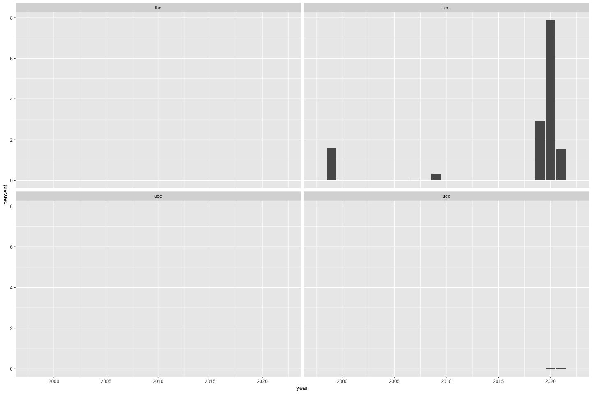<!-- -->

### adipose_clipped

``` r
# catch_format %>%
#   mutate(year = year(date)) %>%
#   group_by(site, year, adipose_clipped) %>%
#   summarize(count = sum(count, na.rm = T)) %>%
#   left_join(total_count) %>%
#   mutate(percent = (count/total)*100) %>%
#   ggplot(aes(x = year, y = percent, fill = adipose_clipped)) +
#   geom_col() +
#   facet_wrap(~site, scales = "free_y") +
#   theme_minimal() +
#   theme(legend.position = "bottom")
```

### weight

Figure below shows the percent of total fish counted that have a weight
measurement.

``` r
catch_format %>%
  filter(!is.na(weight)) %>%
  mutate(year = year(date)) %>%
  group_by(site, year) %>%
  summarize(count = sum(count, na.rm = T)) %>%
  left_join(total_count) %>%
  mutate(percent = (count/total)*100) %>%
  ggplot(aes(x = year, y = percent)) +
  geom_col() +
  facet_wrap(~site)
```

    ## `summarise()` has grouped output by 'site'. You can override using the
    ## `.groups` argument.
    ## Joining with `by = join_by(site, year)`

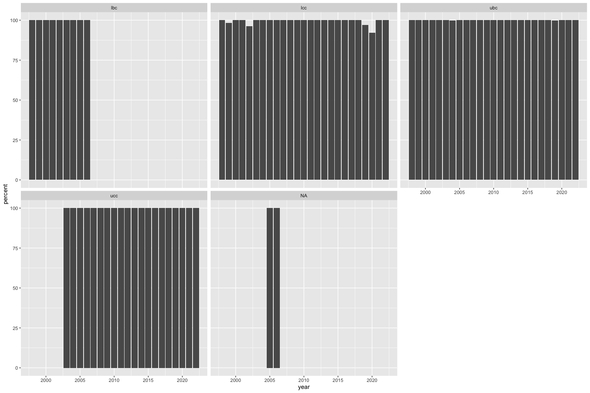<!-- --> \##
Save data

``` r
f <- function(input, output) write_csv(input, file = output)

gcs_upload(catch_format,
           object_function = f,
           type = "csv",
           name = "rst/battle_clear_catch_edi.csv",
           predefinedAcl = "bucketLevel")
```

    ## ℹ 2024-01-17 17:19:11 > File size detected as  38.6 Mb

    ## ℹ 2024-01-17 17:19:11 > Found resumeable upload URL:  https://www.googleapis.com/upload/storage/v1/b/jpe-dev-bucket/o/?uploadType=resumable&name=rst%2Fbattle_clear_catch_edi.csv&upload_id=ABPtcPo6EE0_SgWa7420k-esCBFzbKbXhrTGsioeHkhcpzocl1K_OT18AzIPZYp0BEoqZPKfDxdldwO_BKijWf6HDudT_1Y-_APTQK_f9eOHOXuB

# Trap

``` r
# TODO the QC issues noted in code below have persisted so might be worth contacting them so they can fix on their end
trap_format <- trap |> 
  select(sample_date, sample_time, trap_start_date, trap_start_time, station_code, depth_adjust, thalweg, cone, end_counter, debris_tubs, gear_condition, avg_time_per_rev, sample_id) |> 
  rename(trap_visit_id = sample_id,
         trap_stop_date = sample_date,
         trap_stop_time = sample_time,
         counter_end = end_counter,
         is_half_cone_configuration = cone,
         in_thalweg = thalweg,
         site = station_code) %>%
  mutate(stream = case_when(grepl("clear", site) ~ "clear creek",
                            grepl("battle", site) ~ "battle creek"),
         site = case_when(site == "upper battle creek" ~ "ubc",
                          site == "lower battle creek" ~ "lbc",
                          site == "lower clear creek" ~ "lcc", 
                          site == "upper clear creek" ~ "ucc"),
         subsite = site,
         # debris in gallons (1 tub = 10 gallons)
         debris_volume = debris_tubs*10,
         is_half_cone_configuration = ifelse(is_half_cone_configuration == 0.5, T, F),
         # convert average time per revolution to revolutions per minute
         rpms_start = 60/avg_time_per_rev,
         # fix typos in trap start date
         trap_start_date = case_when(
                                trap_visit_id == "207_20" ~ as_date("2020-07-24"),
                                trap_visit_id == "049_20" ~ as_date("2020-02-17"),
                                trap_visit_id == "085_19" ~ as_date("2020-03-25"),
                                trap_visit_id == "274_18" ~ as_date("2018-09-20"),
                                trap_visit_id == "006_16" ~ as_date("2016-01-05"),
                                T ~ trap_start_date),
         trap_stop_date = case_when(trap_visit_id == "050_20" & trap_start_date == "2020-02-20" ~ as_date("2020-02-20"),
                                    T ~ trap_stop_date),
  # fill in missing start dates with the stop date from previous day
         trap_start_date = case_when(is.na(trap_start_date) ~ lag(trap_stop_date),
                                T ~ trap_start_date),
         trap_start_time = case_when(is.na(trap_start_time) ~ lag(trap_stop_time), 
                                T ~ trap_start_time)) %>% 
  select(-debris_tubs, -avg_time_per_rev) %>%
  filter(!is.na(trap_start_date)) %>%
  data.frame() %>%
  distinct()
```

## QA/QC

### trap_start_date, trap_sample_date

``` r
trap_format %>% 
  ggplot(aes(x = trap_stop_date, y = site, color = site)) +
  geom_point()
```

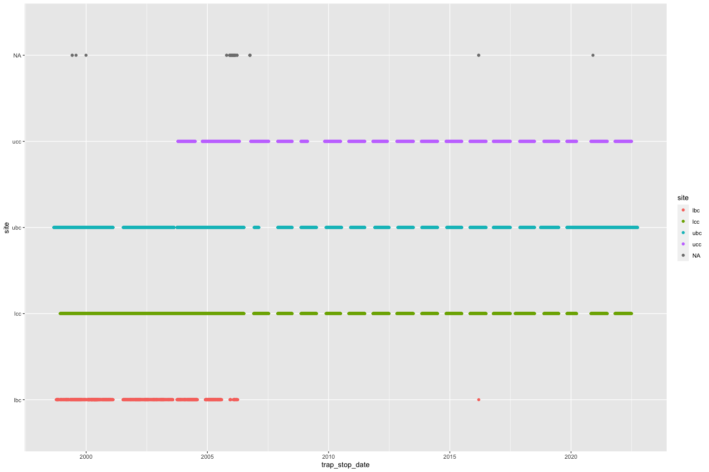<!-- -->

### trap_start_time, trap_sample_time

Does not appear that traps are checked at a specific time

``` r
trap_format %>% 
  ggplot(aes(x = trap_stop_time, y = site, color = site)) +
  geom_point()
```

<!-- -->

### is_half_cone_configuration

Battle and Clear collect data on cone setting. Battle is almost always
at full cone and Clear is at half cone more frequently.

``` r
trap_format %>%
  filter(!is.na(is_half_cone_configuration)) %>%
  group_by(stream, is_half_cone_configuration) %>%
  tally() %>%
  knitr::kable()
```

| stream       | is_half_cone_configuration |    n |
|:-------------|:---------------------------|-----:|
| battle creek | FALSE                      | 7063 |
| battle creek | TRUE                       |  709 |
| clear creek  | FALSE                      | 3166 |
| clear creek  | TRUE                       | 6643 |

### thalweg

Battle and Clear collect information of trap in thalweg and it is almost
always TRUE.

``` r
trap_format %>%
  filter(!is.na(in_thalweg)) %>%
  group_by(stream, in_thalweg) %>%
  tally() %>%
  knitr::kable()
```

| stream       | in_thalweg |    n |
|:-------------|:-----------|-----:|
| battle creek | FALSE      |  106 |
| battle creek | TRUE       | 7388 |
| clear creek  | FALSE      |   77 |
| clear creek  | TRUE       | 9374 |

### location, site, subsite

``` r
trap_format %>%
  group_by(stream, site, subsite) %>%
  tally()
```

    ## # A tibble: 6 × 4
    ## # Groups:   stream, site [6]
    ##   stream       site  subsite     n
    ##   <chr>        <chr> <chr>   <int>
    ## 1 battle creek lbc   lbc      1939
    ## 2 battle creek ubc   ubc      6606
    ## 3 battle creek <NA>  <NA>       71
    ## 4 clear creek  lcc   lcc      6630
    ## 5 clear creek  ucc   ucc      4397
    ## 6 <NA>         <NA>  <NA>        7

### debris_volume

``` r
trap_format %>%
  ggplot(aes(x = trap_stop_date, y = debris_volume, color = stream)) +
  geom_point()
```

<!-- -->

``` r
trap_format %>%
  ggplot(aes(x = stream, y = debris_volume)) +
  geom_boxplot()
```

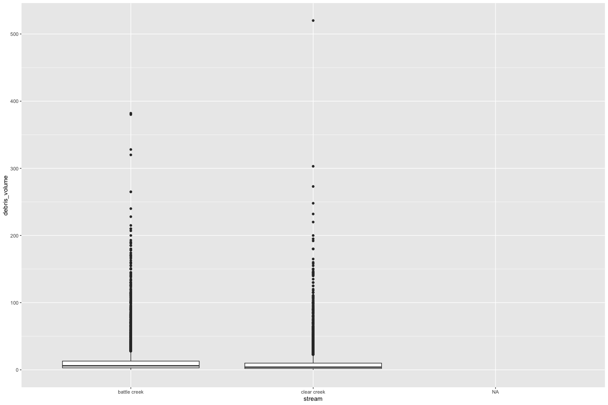<!-- -->

### rpms_start, rpms_end

``` r
trap_format %>%
  ggplot(aes(x = trap_stop_date, y = rpms_start, color = stream)) +
  geom_point()
```

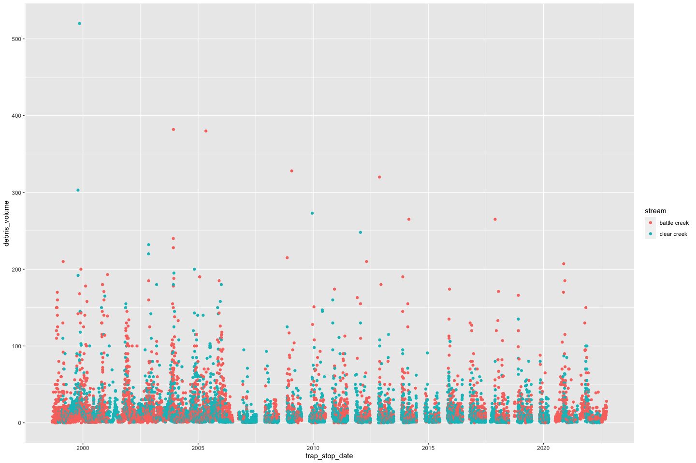<!-- -->

## Save data

``` r
f <- function(input, output) write_csv(input, file = output)

gcs_upload(trap_format,
           object_function = f,
           type = "csv",
           name = "rst/battle_clear_trap_edi.csv",
           predefinedAcl = "bucketLevel")
```

    ## ℹ 2024-01-17 17:19:18 > File size detected as  2.3 Mb

    ## ==Google Cloud Storage Object==
    ## Name:                rst/battle_clear_trap_edi.csv 
    ## Type:                csv 
    ## Size:                2.3 Mb 
    ## Media URL:           https://www.googleapis.com/download/storage/v1/b/jpe-dev-bucket/o/rst%2Fbattle_clear_trap_edi.csv?generation=1705540759260093&alt=media 
    ## Download URL:        https://storage.cloud.google.com/jpe-dev-bucket/rst%2Fbattle_clear_trap_edi.csv 
    ## Public Download URL: https://storage.googleapis.com/jpe-dev-bucket/rst%2Fbattle_clear_trap_edi.csv 
    ## Bucket:              jpe-dev-bucket 
    ## ID:                  jpe-dev-bucket/rst/battle_clear_trap_edi.csv/1705540759260093 
    ## MD5 Hash:            8Nl8u1GuvoFrDSTUM1xuwg== 
    ## Class:               STANDARD 
    ## Created:             2024-01-18 01:19:19 
    ## Updated:             2024-01-18 01:19:19 
    ## Generation:          1705540759260093 
    ## Meta Generation:     1 
    ## eTag:                CL2X7Lji5YMDEAE= 
    ## crc32c:              5Lqn5w==

# Release

``` r
release_format <- release |> 
  select(-hatchery_origin) |> 
  rename(site_released = release_site,
         night_release = day_or_night_release,
         temperature_at_release = release_temp,
         turbidity_at_release = release_turbidity,
         flow_at_release = release_flow,
         run_released = fws_run) |> 
  mutate(stream = case_when(grepl("clear", site) ~ "clear creek",
                            grepl("battle", site) ~ "battle creek"),
         site = case_when(site == "upper battle creek" ~ "ubc",
                          site == "lower battle creek" ~ "lbc",
                          site == "lower clear creek" ~ "lcc", 
                          site == "upper clear creek" ~ "ucc"),
         night_release = ifelse(night_release == "night", T, F),
         origin_released = ifelse(is.na(origin_released), "not recorded", origin_released),
         run_released = ifelse(is.na(run_released), "not recorded", run_released))
```

## QA/QC

### release_id

Release id are unique identifiers for an efficiency trial on a specific
tributary. There are 1809 unique release IDs

``` r
release_format %>% 
  group_by(site) %>% 
  tally()
```

    ## # A tibble: 3 × 2
    ##   site      n
    ##   <chr> <int>
    ## 1 lcc     317
    ## 2 ubc     255
    ## 3 ucc     228

### release_date

``` r
release_format %>% ggplot() + 
  geom_point(aes(x = date_released, y = stream, color = stream), alpha = .1) + 
  scale_color_manual(values = color_pal) +
  theme_minimal() + 
  theme(legend.position = "bottom", 
        text = element_text(size = 18),
        axis.text.x = element_text(angle = 90, vjust = 0.5, hjust=1)) 
```

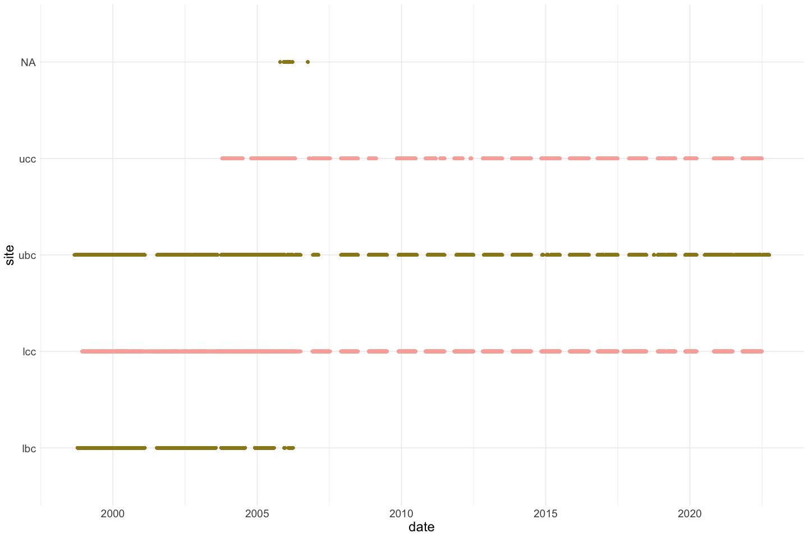<!-- -->

### release_time

``` r
release_format %>% ggplot() + 
  geom_point(aes(x = time_released, y = stream, color = stream), alpha = .1) + 
  scale_color_manual(values = color_pal) +
  theme_minimal() + 
  scale_x_time() +
  theme(legend.position = "bottom", 
        text = element_text(size = 18),
        axis.text.x = element_text(angle = 90, vjust = 0.5, hjust=1)) 
```

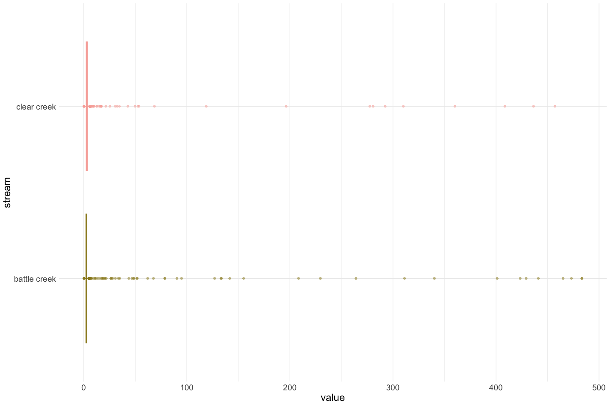<!-- -->

### number_released

``` r
release_format %>% ggplot() + 
  geom_histogram(aes(x = number_released, fill = stream), alpha = .5) + 
  scale_fill_manual(values = color_pal) +
  theme_minimal() + 
  theme(legend.position = "bottom", 
        text = element_text(size = 18),
        axis.text.x = element_text(angle = 90, vjust = 0.5, hjust=1)) 
```

    ## `stat_bin()` using `bins = 30`. Pick better value with `binwidth`.

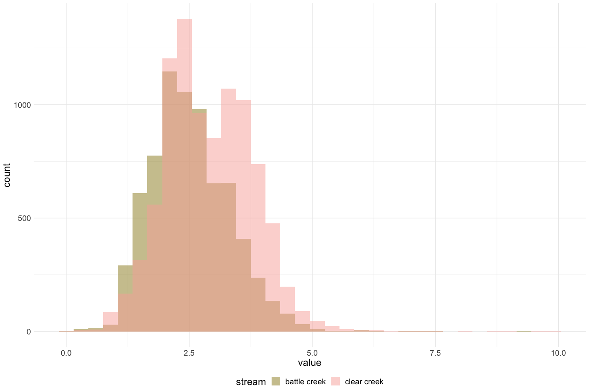<!-- -->

### median_fork_length_released

``` r
release_format %>% 
  ggplot(aes(x = median_fork_length_released, fill = stream)) + 
  geom_histogram(breaks=seq(0, 200, by=2), alpha = .5) + 
  scale_x_continuous(breaks=seq(0, 200, by=25)) +
  scale_fill_manual(values = color_pal) +
  theme_minimal() +
  labs(title = "median fork length released distribution") + 
  theme(legend.position = "bottom", 
        text = element_text(size = 18),
        axis.text.x = element_text(angle = 90, vjust = 0.5, hjust=1)) 
```

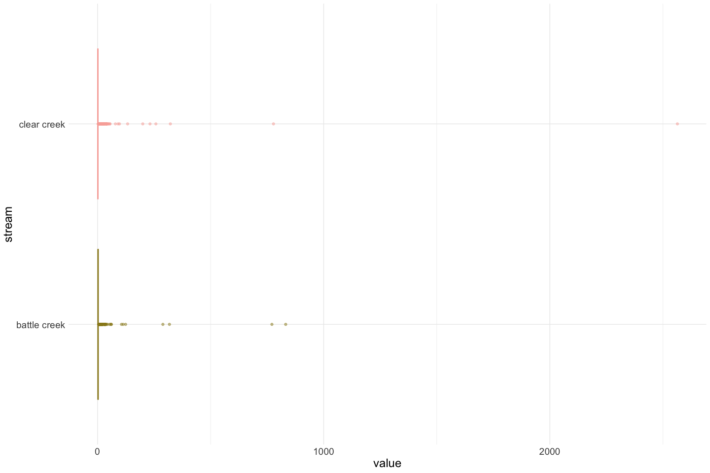<!-- -->

``` r
release_format %>% 
  mutate(year = as.factor(lubridate::year(date_released))) %>%
  ggplot(aes(x = median_fork_length_released, y = year, fill = stream)) + 
  geom_boxplot() + 
  scale_fill_manual(values = color_pal) +
  theme_minimal() +
  labs(title = "median fork length released by year") + 
  theme(legend.position = "bottom", 
        text = element_text(size = 18),
        axis.text.x = element_text(angle = 90, vjust = 0.5, hjust=1)) 
```

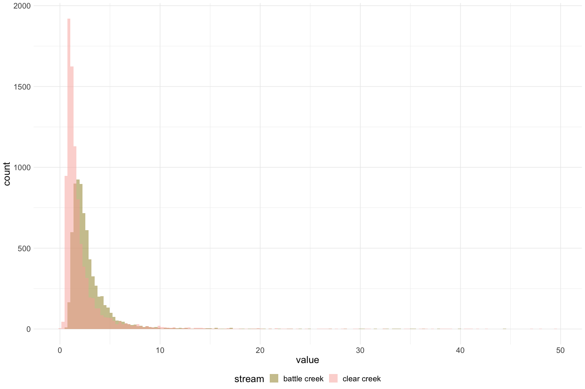<!-- -->

### night_release

Percent night release

``` r
total_count <- release_format %>%
  mutate(year = year(date_released)) %>%
  group_by(site, year) %>%
  summarize(total = length(release_id))
```

    ## `summarise()` has grouped output by 'site'. You can override using the
    ## `.groups` argument.

``` r
release_format %>%
  filter(night_release == T) %>%
  mutate(year = year(date_released)) %>%
  group_by(site, year) %>%
  summarize(count = length(release_id)) %>%
  left_join(total_count) %>%
  mutate(percent = (count/total)*100) %>%
  ggplot(aes(x = year, y = percent)) +
  geom_col() +
  facet_wrap(~site)
```

    ## `summarise()` has grouped output by 'site'. You can override using the
    ## `.groups` argument.
    ## Joining with `by = join_by(site, year)`

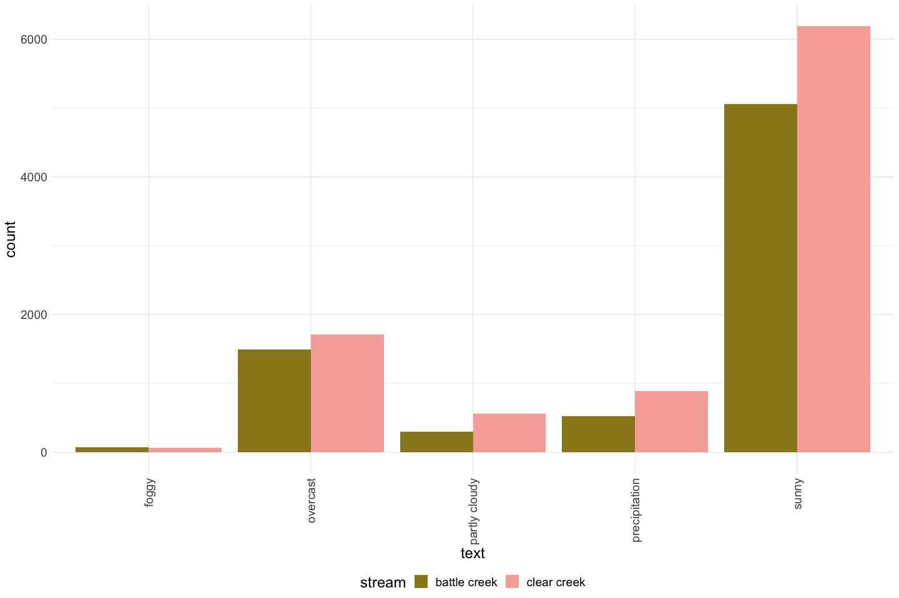<!-- -->

### days_held_post_mark

Only battle and clear provide the days held post mark (pre release),
most fish are held one day at most before release

``` r
release_format %>% 
  ggplot() + 
  geom_histogram(aes(x = days_held_post_mark, fill = stream), alpha = .5, binwidth = 1) +
  scale_fill_manual(values = color_pal) +
  theme_minimal() + 
  theme(legend.position = "bottom", 
        text = element_text(size = 18),
        axis.text.x = element_text(angle = 90, vjust = 0.5, hjust=1)) 
```

<!-- -->

### flow_at_release

``` r
release_format %>% 
  ggplot() + 
  geom_histogram(aes(x = flow_at_release, fill = stream), alpha = .5, binwidth = 25) +
  scale_fill_manual(values = color_pal) +
  theme_minimal() + 
  theme(legend.position = "bottom", 
        text = element_text(size = 18),
        axis.text.x = element_text(angle = 90, vjust = 0.5, hjust=1)) 
```

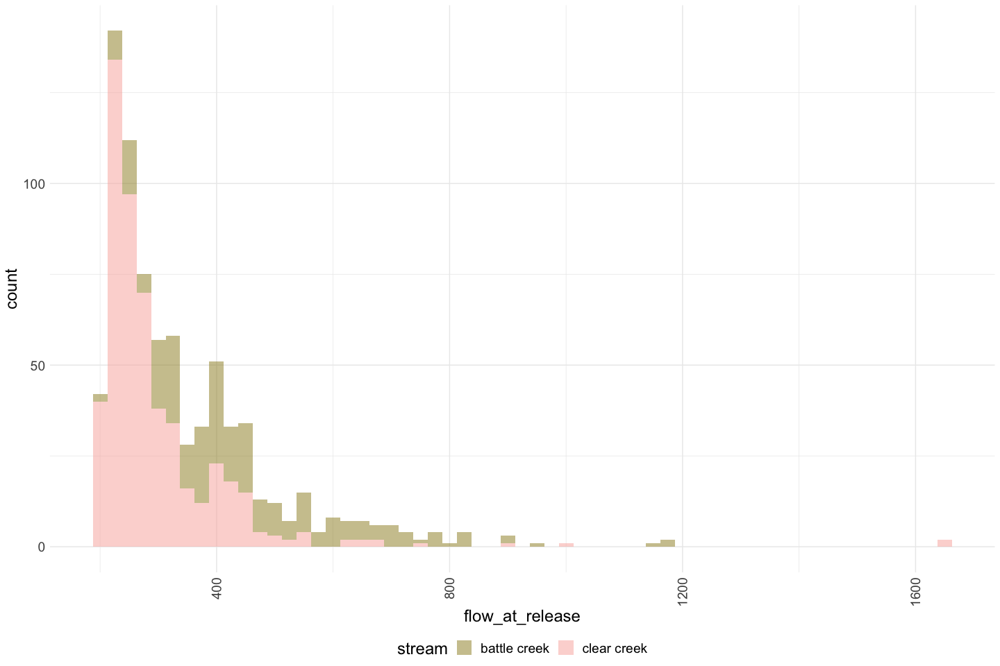<!-- -->

### temperature_at_release

``` r
release_format %>% 
  ggplot() + 
  geom_histogram(aes(x = temperature_at_release, fill = stream), alpha = .5, binwidth = 2.5) +
  scale_fill_manual(values = color_pal) +
  theme_minimal() + 
  theme(legend.position = "bottom", 
        text = element_text(size = 18),
        axis.text.x = element_text(angle = 90, vjust = 0.5, hjust=1)) 
```

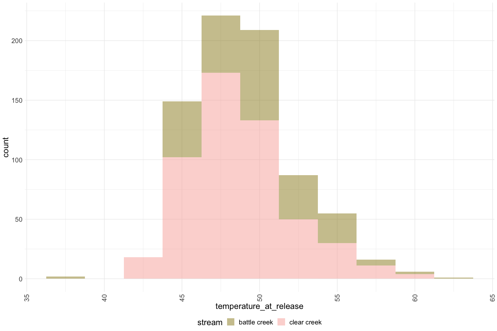<!-- -->

### turbidity_at_release

``` r
release_format %>% 
  ggplot() + 
  geom_histogram(aes(x = turbidity_at_release, fill = stream), alpha = .5, binwidth = 2) +
  scale_fill_manual(values = color_pal) +
  theme_minimal() + 
  theme(legend.position = "bottom", 
        text = element_text(size = 18),
        axis.text.x = element_text(angle = 90, vjust = 0.5, hjust=1)) 
```

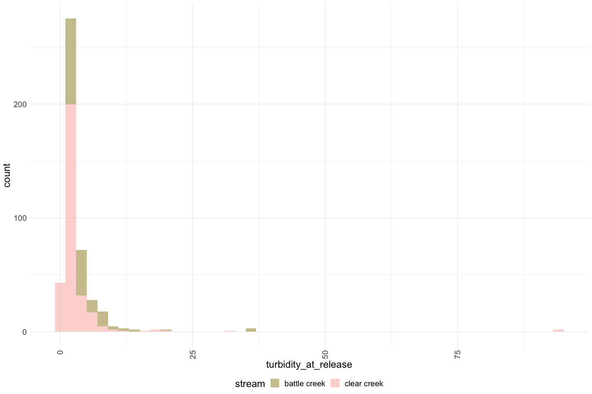<!-- -->
\## Save data

``` r
f <- function(input, output) write_csv(input, file = output)

gcs_upload(release_format,
           object_function = f,
           type = "csv",
           name = "rst/battle_clear_release_edi.csv",
           predefinedAcl = "bucketLevel")
```

    ## ℹ 2024-01-17 17:19:24 > File size detected as  85 Kb

    ## ==Google Cloud Storage Object==
    ## Name:                rst/battle_clear_release_edi.csv 
    ## Type:                csv 
    ## Size:                85 Kb 
    ## Media URL:           https://www.googleapis.com/download/storage/v1/b/jpe-dev-bucket/o/rst%2Fbattle_clear_release_edi.csv?generation=1705540764951240&alt=media 
    ## Download URL:        https://storage.cloud.google.com/jpe-dev-bucket/rst%2Fbattle_clear_release_edi.csv 
    ## Public Download URL: https://storage.googleapis.com/jpe-dev-bucket/rst%2Fbattle_clear_release_edi.csv 
    ## Bucket:              jpe-dev-bucket 
    ## ID:                  jpe-dev-bucket/rst/battle_clear_release_edi.csv/1705540764951240 
    ## MD5 Hash:            0Xt7+3XymKXbRGeqLBMLDQ== 
    ## Class:               STANDARD 
    ## Created:             2024-01-18 01:19:24 
    ## Updated:             2024-01-18 01:19:24 
    ## Generation:          1705540764951240 
    ## Meta Generation:     1 
    ## eTag:                CMjFx7vi5YMDEAE= 
    ## crc32c:              786GXA==

# Recapture

``` r
# TODO this error persists and might be good to communciate with them: number_recaptured == 1180
recapture_format <- recapture |> 
  select(-c(release_site, fws_run, hatchery_origin)) |> 
  mutate(stream = case_when(grepl("clear", site) ~ "clear creek",
                            grepl("battle", site) ~ "battle creek"),
         site = case_when(site == "upper battle creek" ~ "ubc",
                          site == "lower battle creek" ~ "lbc",
                          site == "lower clear creek" ~ "lcc", 
                          site == "upper clear creek" ~ "ucc"),
         subsite = site,
         number_recaptured = ifelse(number_recaptured == 1180, 11, number_recaptured))
```

## QA/QC

### release_id

``` r
recapture_format%>% 
  group_by(site) %>% 
  tally()
```

    ## # A tibble: 3 × 2
    ##   site      n
    ##   <chr> <int>
    ## 1 lcc    1585
    ## 2 ubc    1275
    ## 3 ucc    1140

### recaptured_date

``` r
recapture_format %>% ggplot() + 
  geom_point(aes(x = date_recaptured, y = stream, color = stream), alpha = .1) + 
  scale_color_manual(values = color_pal) +
  theme_minimal() + 
  theme(legend.position = "bottom", 
        text = element_text(size = 18),
        axis.text.x = element_text(angle = 90, vjust = 0.5, hjust=1)) 
```

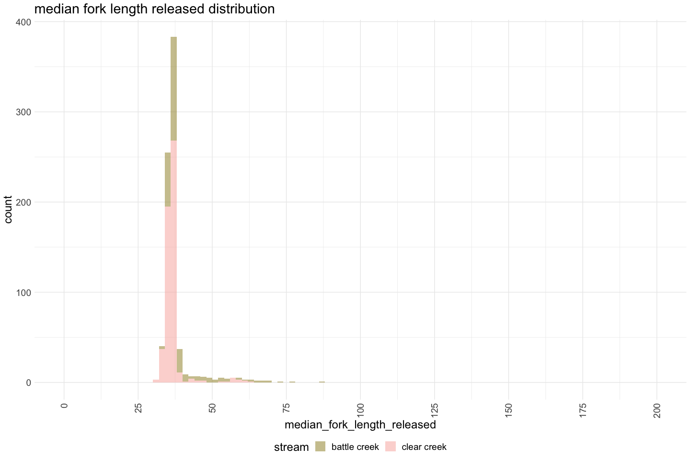<!-- -->

### number_recaptured

``` r
recapture_format %>% 
  group_by(release_id, stream) %>% 
  summarise(number_recaptured = sum(number_recaptured, na.rm = T)) %>% 
  ungroup() %>%
  ggplot() + 
  geom_histogram(aes(x = number_recaptured, fill = stream), alpha = .5, binwidth = 10, position = "identity") +
  scale_fill_manual(values = color_pal) +
  theme_minimal() + 
  theme(legend.position = "bottom", 
        text = element_text(size = 18),
        axis.text.x = element_text(angle = 90, vjust = 0.5, hjust=1)) 
```

    ## `summarise()` has grouped output by 'release_id'. You can override using the
    ## `.groups` argument.

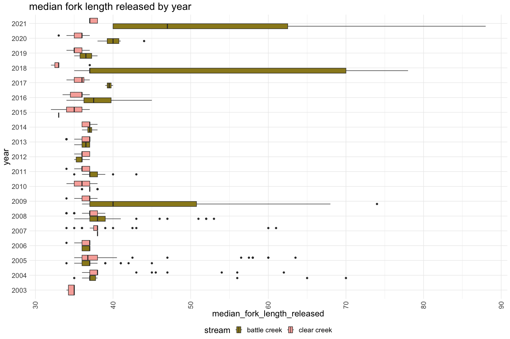<!-- -->

``` r
recapture_format %>% 
  filter(number_recaptured > 250)
```

    ## # A tibble: 0 × 7
    ## # ℹ 7 variables: release_id <chr>, date_recaptured <date>, site <chr>,
    ## #   number_recaptured <dbl>, median_fork_length_recaptured <dbl>, stream <chr>,
    ## #   subsite <chr>

Manually update battle value of 1180 - We used the totals column in the
raw data to update this outlier data point. The totals column reported
11 when the catch-by-day columns had an error of 1180. Fixed above

### median_fork_length_recaptured

Individual fork lengths for recaptured fish are not provided by Battle
Creek or Clear Creek. Battle and Clear Creek only show median fork
length per efficiency trial.

``` r
recapture_format %>% 
  ggplot(aes(x = median_fork_length_recaptured, fill = stream)) + 
  geom_histogram(breaks=seq(0, 200, by=2),  alpha = .5, position = "identity") + 
  scale_x_continuous(breaks=seq(0, 200, by=25)) +
  scale_fill_manual(values = color_pal) +
  theme_minimal() +
  labs(title = "median fork length recaptured distribution") + 
  theme(legend.position = "bottom", 
        text = element_text(size = 18),
        axis.text.x = element_text(angle = 90, vjust = 0.5, hjust=1)) 
```

<!-- -->

``` r
recapture_format %>% 
  mutate(year = as.factor(lubridate::year(date_recaptured))) %>%
  ggplot(aes(x = median_fork_length_recaptured, y = year, fill = stream)) + 
  geom_boxplot() + 
  scale_fill_manual(values = color_pal) +
  theme_minimal() +
  labs(title = "median fork length recaptured by year") + 
  theme(legend.position = "bottom", 
        text = element_text(size = 18),
        axis.text.x = element_text(angle = 90, vjust = 0.5, hjust=1)) 
```

<!-- -->
\## Save data

``` r
f <- function(input, output) write_csv(input, file = output)

gcs_upload(recapture_format,
           object_function = f,
           type = "csv",
           name = "rst/battle_clear_recapture_edi.csv",
           predefinedAcl = "bucketLevel")
```

    ## ℹ 2024-01-17 17:19:27 > File size detected as  170 Kb

    ## ==Google Cloud Storage Object==
    ## Name:                rst/battle_clear_recapture_edi.csv 
    ## Type:                csv 
    ## Size:                170 Kb 
    ## Media URL:           https://www.googleapis.com/download/storage/v1/b/jpe-dev-bucket/o/rst%2Fbattle_clear_recapture_edi.csv?generation=1705540767748850&alt=media 
    ## Download URL:        https://storage.cloud.google.com/jpe-dev-bucket/rst%2Fbattle_clear_recapture_edi.csv 
    ## Public Download URL: https://storage.googleapis.com/jpe-dev-bucket/rst%2Fbattle_clear_recapture_edi.csv 
    ## Bucket:              jpe-dev-bucket 
    ## ID:                  jpe-dev-bucket/rst/battle_clear_recapture_edi.csv/1705540767748850 
    ## MD5 Hash:            At1xK0Z2K1b87pNuxBDrdA== 
    ## Class:               STANDARD 
    ## Created:             2024-01-18 01:19:27 
    ## Updated:             2024-01-18 01:19:27 
    ## Generation:          1705540767748850 
    ## Meta Generation:     1 
    ## eTag:                CPKl8rzi5YMDEAE= 
    ## crc32c:              bR9IQQ==
