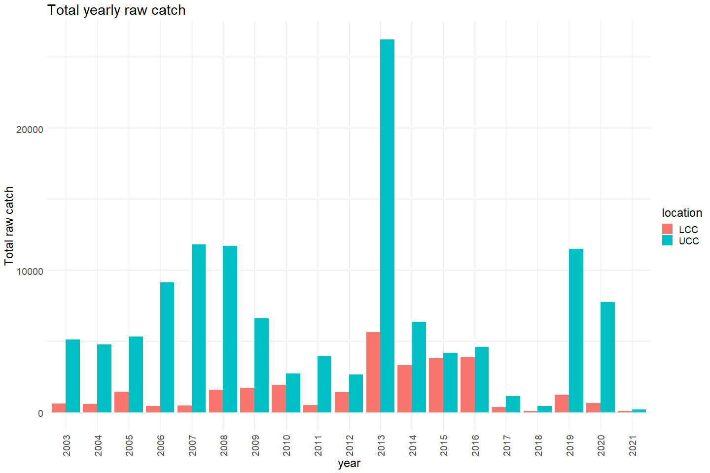
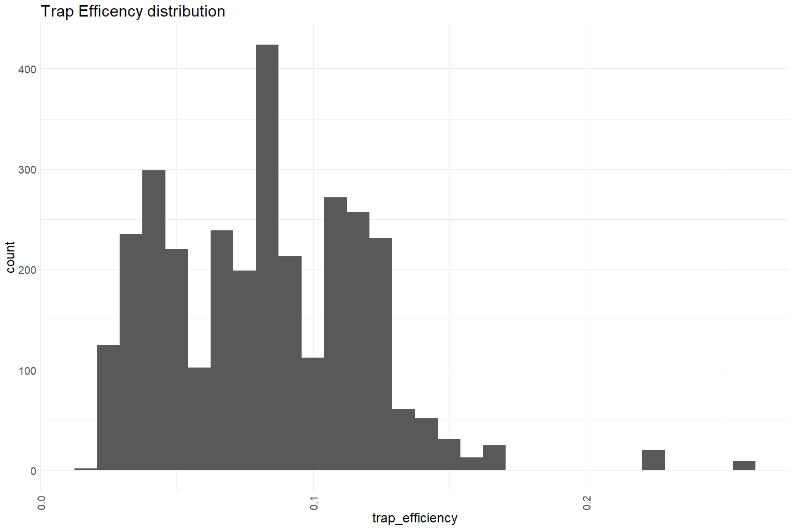
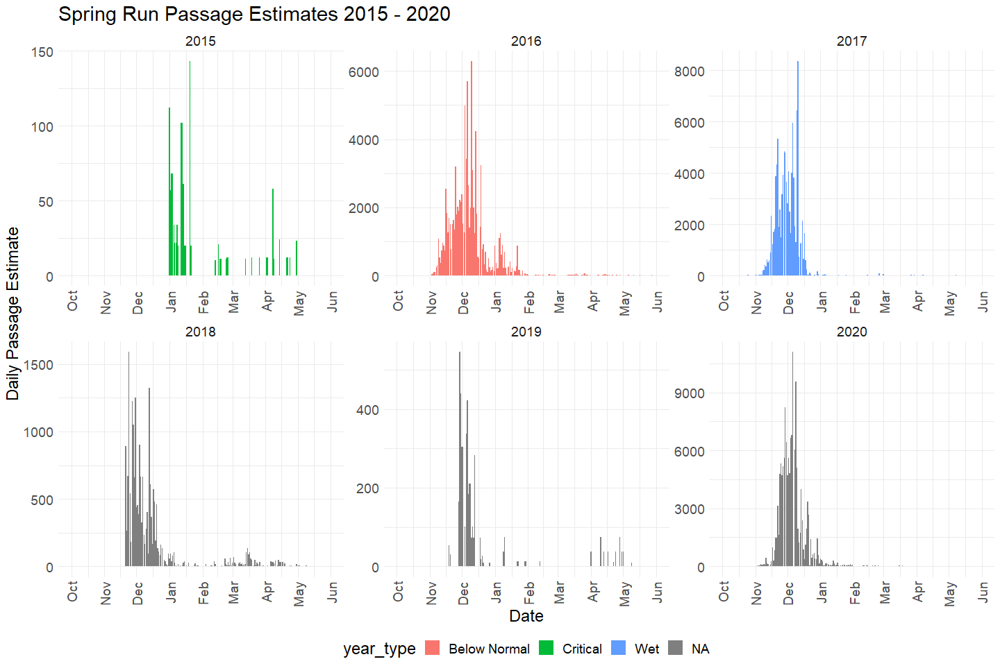
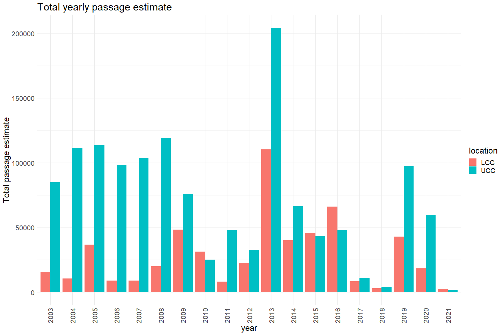

Clear Creek RST Passage Estimates QC
================
Erin Cain
11/10/2021

# Clear Creek RST Daily Passage Estimates

## Description of Monitoring Data

Clear Creek daily passage data sets and the R code used to calculate
them is the `Daily Passage.R` file. Note that some not fished days have
passage data, on those days we interpolated that catch data based either
on catch that occurred on days before and after the missing days. If one
day was missing, we would use the average of the catch the day before
and after the missing day, if four days were missed, we use the average
of four days before and after, etc. Or, if flow was constant and we can
tell when the trap stopped fishing at UCC and LCC we can use the percent
of daily catch method using data from our hourly sampling from 24-hour
sampling events.

**Note:** This dataset is only spring run. We have additional datasets
structured the same way for the other runs.

**Timeframe:** 2003 - 2021

**Video Season:** Video operated all year

**Completeness of Record throughout timeframe:** Data for every year

**Sampling Location:** Upper Clear Creek and Lower Clear Creek

**Data Contact:** [Mike Schraml](mailto:mike_schraml@fws.gov)

## Access Cloud Data

``` r
# Run Sys.setenv() to specify GCS_AUTH_FILE and GCS_DEFAULT_BUCKET before running 
# getwd() to see how to specify paths 
# Open object from google cloud storage
# Set your authentication using gcs_auth
gcs_auth(json_file = Sys.getenv("GCS_AUTH_FILE"))
# Set global bucket 
gcs_global_bucket(bucket = Sys.getenv("GCS_DEFAULT_BUCKET"))

gcs_list_objects()
# git data and save as xlsx
gcs_get_object(object_name = "rst/clear-creek/data-raw/Spring-run daily Passage.xlsx",
               bucket = gcs_get_global_bucket(),
               saveToDisk = "SR_passage_estimats.xlsx",
               overwrite = TRUE)
```

Read in data from google cloud, glimpse raw data and domain description
sheet:

``` r
# read in data to clean
sheets <- excel_sheets("SR_passage_estimats.xlsx")
sheets # UBC is upper battle creek, please see rst/battle/battle_creek_passage_estimate.md for info on this dataset
```

    ## [1] "UCC Passage" "LCC Passage" "UBC Passage"

``` r
raw_upper_passage_estimates <- read_excel("SR_passage_estimats.xlsx", sheet = "UCC Passage") %>% 
  mutate(location = "UCC") %>%
  glimpse()
```

    ## Rows: 6,501
    ## Columns: 6
    ## $ Date              <chr> "10/01/2003", "10/02/2003", "10/03/2003", "10/04/200~
    ## $ `Daily catch`     <dbl> 0, 0, 0, 0, 0, 0, 0, 0, 0, 0, 0, 0, 0, 0, 0, 0, 0, 0~
    ## $ `Trap efficiency` <dbl> NA, NA, NA, NA, NA, NA, NA, NA, NA, NA, NA, NA, NA, ~
    ## $ Passage           <dbl> 0, 0, 0, 0, 0, 0, 0, 0, 0, 0, 0, 0, 0, 0, 0, 0, 0, 0~
    ## $ `Trap fished`     <chr> "Fished", "Fished", "Fished", "Fished", "Fished", "F~
    ## $ location          <chr> "UCC", "UCC", "UCC", "UCC", "UCC", "UCC", "UCC", "UC~

``` r
raw_lower_passage_estimates <- read_excel("SR_passage_estimats.xlsx", sheet = "LCC Passage") %>%
  mutate(location = "LCC") %>%
  glimpse()
```

    ## Rows: 6,489
    ## Columns: 6
    ## $ Date              <chr> "10/01/2003", "10/02/2003", "10/03/2003", "10/04/200~
    ## $ `Daily catch`     <dbl> 0, 0, 0, 0, 0, 0, 0, 0, 0, 0, 0, 0, 0, 0, 0, 0, 0, 0~
    ## $ `Trap efficiency` <dbl> NA, NA, NA, NA, NA, NA, NA, NA, NA, NA, NA, NA, NA, ~
    ## $ Passage           <dbl> 0, 0, 0, 0, 0, 0, 0, 0, 0, 0, 0, 0, 0, 0, 0, 0, 0, 0~
    ## $ `Trap fished`     <chr> "Fished", "Fished", "Fished", "Fished", "Fished", "F~
    ## $ location          <chr> "LCC", "LCC", "LCC", "LCC", "LCC", "LCC", "LCC", "LC~

## Data transformations

``` r
# For different excel sheets for each year read in and combine years here
combined_passage_estimates <- bind_rows(raw_upper_passage_estimates, raw_lower_passage_estimates)
```

``` r
cleaner_passage_estimate <- combined_passage_estimates %>% 
  janitor::clean_names() %>% 
  rename(catch = daily_catch,
         passage_estimate = passage) %>%
  mutate(date = as.Date(date, "%m/%d/%Y")) %>% glimpse()
```

    ## Rows: 12,990
    ## Columns: 6
    ## $ date             <date> 2003-10-01, 2003-10-02, 2003-10-03, 2003-10-04, 2003~
    ## $ catch            <dbl> 0, 0, 0, 0, 0, 0, 0, 0, 0, 0, 0, 0, 0, 0, 0, 0, 0, 0,~
    ## $ trap_efficiency  <dbl> NA, NA, NA, NA, NA, NA, NA, NA, NA, NA, NA, NA, NA, N~
    ## $ passage_estimate <dbl> 0, 0, 0, 0, 0, 0, 0, 0, 0, 0, 0, 0, 0, 0, 0, 0, 0, 0,~
    ## $ trap_fished      <chr> "Fished", "Fished", "Fished", "Fished", "Fished", "Fi~
    ## $ location         <chr> "UCC", "UCC", "UCC", "UCC", "UCC", "UCC", "UCC", "UCC~

## Data Dictionary

The following table describes the variables included in this dataset and
the percent that do not include data.

``` r
percent_na <- cleaner_passage_estimate %>%
  summarise_all(list(name = ~sum(is.na(.))/length(.))) %>%
  pivot_longer(cols = everything())
  
data_dictionary <- tibble(variables = colnames(cleaner_passage_estimate),
                          description = c("Date",
                                          "Raw catch of spring run",
                                          "Trap efficiency",
                                          "Passage estimate fish count",
                                          "Trap fished or not fished",
                                          "Describes if the count is from LCC or UCC"),
                          
                          percent_na = round(percent_na$value*100)
                          
)
knitr::kable(data_dictionary)
```

| variables         | description                               | percent\_na |
|:------------------|:------------------------------------------|------------:|
| date              | Date                                      |           0 |
| catch             | Raw catch of spring run                   |          39 |
| trap\_efficiency  | Trap efficiency                           |          76 |
| passage\_estimate | Passage estimate fish count               |          39 |
| trap\_fished      | Trap fished or not fished                 |           0 |
| location          | Describes if the count is from LCC or UCC |           0 |

## Explore Numeric Variables:

``` r
cleaner_passage_estimate %>% select_if(is.numeric) %>% colnames()
```

    ## [1] "catch"            "trap_efficiency"  "passage_estimate"

### Variable: `catch`

Raw catch of spring run

**Plotting fish counts over period of record**

Note shows one daily catch value for both traps.

``` r
cleaner_passage_estimate %>% 
  group_by(date) %>%
  summarise(total_daily_catch = sum(catch)) %>%
  filter(year(date) > 2014, year(date) < 2021) %>%
  mutate(water_year = ifelse(month(date) %in% 10:12, year(date) + 1, year(date))) %>% 
  left_join(sac_indices) %>%
  mutate(year = as.factor(year(date)),
         fake_year = if_else(month(date) %in% 10:12, 1900, 1901),
         fake_date = as.Date(paste0(fake_year,"-", month(date), "-", day(date)))) %>%
  filter(water_year < 2021) %>%
  ggplot(aes(x = fake_date, y = total_daily_catch, fill = year_type)) + 
  geom_col() + 
  scale_x_date(labels = date_format("%b"), limits = c(as.Date("1900-10-01"), as.Date("1901-06-01")), date_breaks = "1 month") + 
  theme_minimal() + 
  theme(text = element_text(size = 18),
        axis.text.x = element_text(angle = 90, vjust = 0.5, hjust=1),
        legend.position = "bottom") + 
  labs(title = "Spring Run Raw Catch 2015 - 2020",
       y = "Daily Raw Catch",
       x = "Date")+ 
  facet_wrap(~water_year, scales = "free") +
  scale_color_manual(palette)
```

    ## Joining, by = "water_year"

<!-- -->

``` r
cleaner_passage_estimate  %>%
  group_by(year = year(date), location) %>%
  summarise(total_yearly_catch = sum(catch, na.rm = T)) %>%
  mutate(year = as.factor(year)) %>%
  ggplot(aes(x = year, y = total_yearly_catch, fill = location)) + 
  geom_col(position = "dodge") + 
  theme_minimal() +
  labs(title = "Total yearly raw catch",
       y = "Total raw catch") + 
  theme(text = element_text(size = 18),
        axis.text.x = element_text(angle = 90, vjust = 0.5, hjust=1)) 
```

    ## `summarise()` has grouped output by 'year'. You can override using the `.groups` argument.

<!-- -->

**Numeric Summary of counts over Period of Record**

``` r
# Table with summary statistics
summary(cleaner_passage_estimate$catch)
```

    ##    Min. 1st Qu.  Median    Mean 3rd Qu.    Max.    NA's 
    ##    0.00    0.00    0.00   19.69    3.00 1699.00    5028

**NA and Unknown Values**

-   38.7 % of values in the `catch` column are NA.

### Variable: `trap_efficiency`

**Plotting trap\_efficiency**

``` r
cleaner_passage_estimate %>% 
  ggplot(aes(x = trap_efficiency)) + 
  geom_histogram() + 
  # scale_x_continuous(breaks=seq(0, 200, by=25)) +
  theme_minimal() +
  labs(title = "Trap Efficency distribution") + 
  theme(text = element_text(size = 18),
        axis.text.x = element_text(angle = 90, vjust = 0.5, hjust=1)) 
```

    ## `stat_bin()` using `bins = 30`. Pick better value with `binwidth`.

<!-- -->

Trap efficiency is fairly low (between 0 and .25)

**Numeric Summary of trap\_efficiency over Period of Record**

``` r
# Table with summary statistics
summary(cleaner_passage_estimate$trap_efficiency)
```

    ##    Min. 1st Qu.  Median    Mean 3rd Qu.    Max.    NA's 
    ##   0.020   0.051   0.082   0.082   0.107   0.261    9849

**NA and Unknown Values**

-   75.8 % of values in the `trap_efficiency` column are NA.

These NA values seem to mainly correspond with days where no fish were
caught.

### Variable: `passage_estimate`

**Plotting fish counts over period of record**

``` r
cleaner_passage_estimate %>% 
  group_by(date) %>%
  summarise(total_daily_catch = sum(passage_estimate)) %>%
  filter(year(date) > 2014, year(date) < 2021) %>%
  mutate(water_year = ifelse(month(date) %in% 10:12, year(date) + 1, year(date))) %>% 
  left_join(sac_indices) %>%
  mutate(year = as.factor(year(date)),
         fake_year = if_else(month(date) %in% 10:12, 1900, 1901),
         fake_date = as.Date(paste0(fake_year,"-", month(date), "-", day(date)))) %>%
  filter(water_year < 2021) %>%
  ggplot(aes(x = fake_date, y = total_daily_catch, fill = year_type)) + 
  geom_col() + 
  scale_x_date(labels = date_format("%b"), limits = c(as.Date("1900-10-01"), as.Date("1901-06-01")), date_breaks = "1 month") + 
  theme_minimal() + 
  theme(text = element_text(size = 18),
        axis.text.x = element_text(angle = 90, vjust = 0.5, hjust=1),
        legend.position = "bottom") + 
  labs(title = "Spring Run Passage Estimates 2015 - 2020",
       y = "Daily Passage Estimate",
       x = "Date")+ 
  facet_wrap(~water_year, scales = "free") +
  scale_color_manual(palette)
```

    ## Joining, by = "water_year"

<!-- -->

``` r
cleaner_passage_estimate  %>%
  group_by(year = year(date), location) %>%
  summarise(total_yearly_catch = sum(passage_estimate, na.rm = T)) %>%
  mutate(year = as.factor(year)) %>%
  ggplot(aes(x = year, y = total_yearly_catch, fill = location)) + 
  geom_col(position = 'dodge') + 
  theme_minimal() +
  labs(title = "Total yearly passage estimate",
       y = "Total passage estimate") + 
  theme(text = element_text(size = 18),
        axis.text.x = element_text(angle = 90, vjust = 0.5, hjust=1)) 
```

    ## `summarise()` has grouped output by 'year'. You can override using the `.groups` argument.

<!-- -->

**Numeric Summary of counts over Period of Record**

``` r
# Table with summary statistics
summary(cleaner_passage_estimate$passage_estimate)
```

    ##    Min. 1st Qu.  Median    Mean 3rd Qu.    Max.    NA's 
    ##     0.0     0.0     0.0   238.3    38.0 19805.0    5028

**NA and Unknown Values**

-   38.7 % of values in the `passage_estimate` column are NA.

## Explore Categorical variables:

``` r
cleaner_passage_estimate %>% select_if(is.character) %>% colnames()
```

    ## [1] "trap_fished" "location"

### Variable: `trap_fished`

``` r
table(cleaner_passage_estimate$trap_fished) 
```

    ## 
    ##     Fished Not Fished 
    ##       7618       5372

Turn into TRUE, FALSE variable:

``` r
cleaner_passage_estimate$trap_fished <- case_when(
  cleaner_passage_estimate$trap_fished == "Fished" ~ TRUE, 
  cleaner_passage_estimate$trap_fished == "Not Fished" ~ FALSE
)

table(cleaner_passage_estimate$trap_fished) 
```

    ## 
    ## FALSE  TRUE 
    ##  5372  7618

**NA and Unknown Values**

-   0 % of values in the `trap_fished` column are NA.

### Variable: `location`

Describes if the count is from LCC or UCC.

``` r
table(cleaner_passage_estimate$location) 
```

    ## 
    ##  LCC  UCC 
    ## 6489 6501

**NA and Unknown Values**

-   0 % of values in the `location` column are NA.

## Summary of identified issues

-   Passage estimates look good based on preliminary look, I do want to
    review R script used to generate the passage estimates
-   Additionally need to add other runs in if desired

## Next Steps

-   Compare passage estimate method (Provided in R file) with other RST
    passage estimate methods

## Save cleaned data back to google cloud

``` r
clear_rst_passage_estimates <- cleaner_passage_estimate %>% glimpse()
```

    ## Rows: 12,990
    ## Columns: 6
    ## $ date             <date> 2003-10-01, 2003-10-02, 2003-10-03, 2003-10-04, 2003~
    ## $ catch            <dbl> 0, 0, 0, 0, 0, 0, 0, 0, 0, 0, 0, 0, 0, 0, 0, 0, 0, 0,~
    ## $ trap_efficiency  <dbl> NA, NA, NA, NA, NA, NA, NA, NA, NA, NA, NA, NA, NA, N~
    ## $ passage_estimate <dbl> 0, 0, 0, 0, 0, 0, 0, 0, 0, 0, 0, 0, 0, 0, 0, 0, 0, 0,~
    ## $ trap_fished      <lgl> TRUE, TRUE, TRUE, TRUE, TRUE, TRUE, TRUE, TRUE, TRUE,~
    ## $ location         <chr> "UCC", "UCC", "UCC", "UCC", "UCC", "UCC", "UCC", "UCC~

``` r
f <- function(input, output) write_csv(input, file = output)

gcs_upload(clear_rst_passage_estimates,
           object_function = f,
           type = "csv",
           name = "rst/clear-creek/data/clear_rst_passage_estimates.csv")
```
