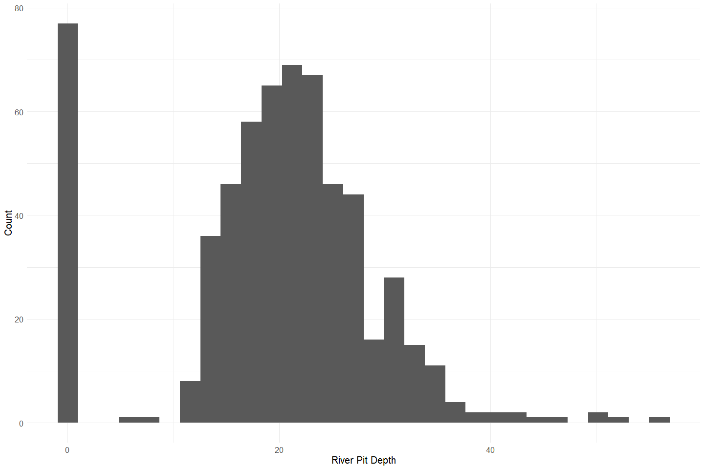
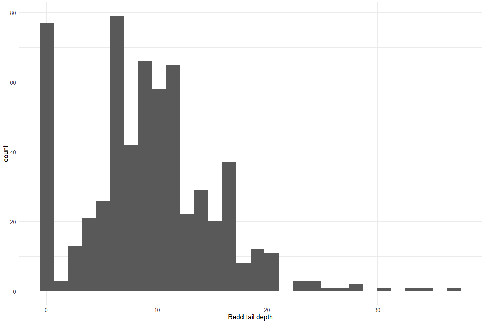
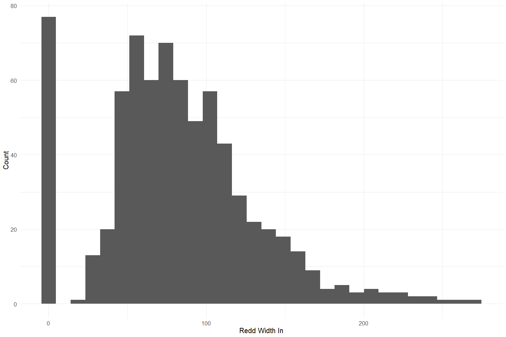
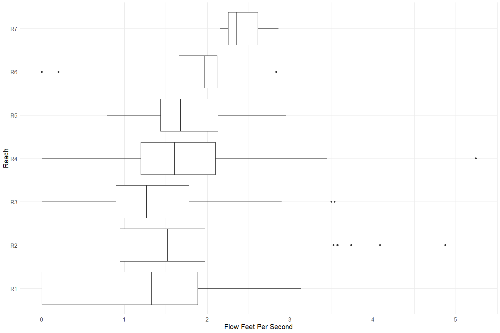
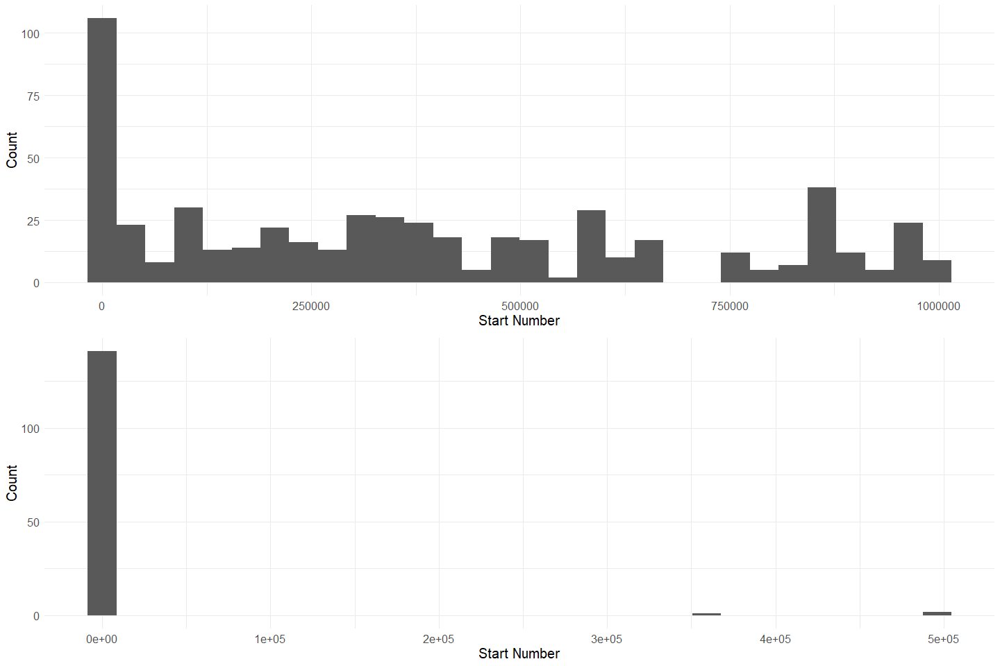
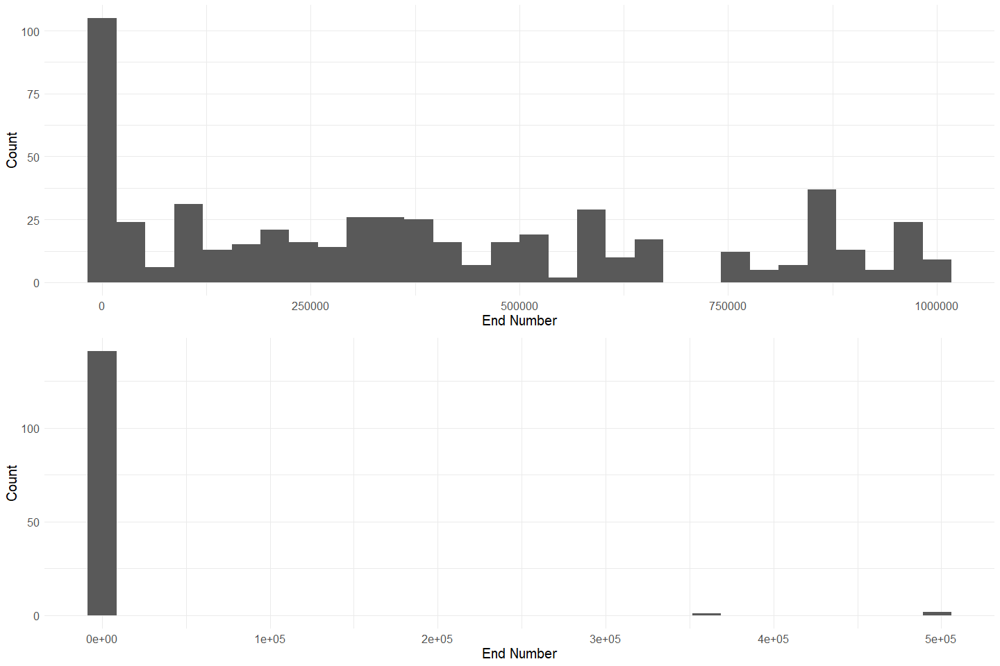

Battle Creek Redd Survey QC
================
Erin Cain
9/29/2021

# Battle Creek Redd Survey

## Description of Monitoring Data

These data were aquired via snorkel and kayak surveys on Battle Creek
from 2001 to 2019. Red location, size, substrate and flow were measured.
Annual monitoring questions and conditions drove the frequency and
detail of individual redd measurements.

**Timeframe:** 2001 - 2019

**Survey Season:**

**Completeness of Record throughout timeframe:** Sampled each year

**Sampling Location:** Battle Creek

**Data Contact:** [Natasha Wingerter](mailto:natasha_wingerter@fws.gov)

Any additional info?

## Access Cloud Data

``` r
# Run Sys.setenv() to specify GCS_AUTH_FILE and GCS_DEFAULT_BUCKET before running 
# getwd() to see how to specify paths 
# Open object from google cloud storage
# Set your authentication using gcs_auth
gcs_auth(json_file = Sys.getenv("GCS_AUTH_FILE"))
# Set global bucket 
gcs_global_bucket(bucket = Sys.getenv("GCS_DEFAULT_BUCKET"))

# git data and save as xlsx
```

Read in data from google cloud, glimpse raw data and domain description
sheet:

``` r
sheets <- excel_sheets("raw_adult_spawn_hold_carcass.xlsx")
sheets 
```

    ## [1] "Notes and Metadata"    "Redd Survey"           "Carcass"              
    ## [4] "Live Holding Spawning"

``` r
raw_redd_data <-read_excel("raw_adult_spawn_hold_carcass.xlsx", 
                           sheet = "Redd Survey",
                           col_types = c("text", "numeric", "numeric", "numeric", "date", 
                                         "text", "numeric", "text", "text", "text", "text", 
                                         "text", "text", "text", "date", "numeric", "numeric", 
                                         "numeric", "numeric", "numeric", "text", "numeric", "numeric",
                                         "numeric", "numeric", "numeric", "numeric", "numeric", "text")) %>% glimpse()
```

    ## Rows: 1,605
    ## Columns: 29
    ## $ Project     <chr> "Snorkel", "Snorkel", "Snorkel", "Snorkel", "Snorkel", "Sn~
    ## $ LONGITUDE   <dbl> -121.9688, -121.9742, -121.9742, -121.9688, -121.9688, -12~
    ## $ LATITUDE    <dbl> 40.40218, 40.40279, 40.40279, 40.40218, 40.40218, 40.41850~
    ## $ YEAR        <dbl> 2001, 2001, 2001, 2001, 2001, 2001, 2001, 2001, 2001, 2001~
    ## $ Sample_Date <dttm> 2001-09-18, 2001-10-03, 2001-10-03, 2001-10-03, 2001-10-0~
    ## $ REACH       <chr> "R3", "R3", "R3", "R3", "R3", "R1", "R1", "R1", "R1", "R2"~
    ## $ RIVER_MILE  <dbl> 2.48, 2.14, 2.14, 2.48, 2.48, 2.94, 2.91, 2.88, 2.85, 1.64~
    ## $ Species_Run <chr> "SCS", "SCS", "SCS", "SCS", "SCS", "SCS", "SCS", "SCS", "S~
    ## $ PRE_SUB     <chr> NA, NA, NA, NA, NA, NA, NA, NA, NA, NA, NA, NA, NA, NA, NA~
    ## $ SIDES_SUB   <chr> NA, NA, NA, NA, NA, NA, NA, NA, NA, NA, NA, NA, NA, NA, NA~
    ## $ TAIL_SUB    <chr> NA, NA, NA, NA, NA, NA, NA, NA, NA, NA, NA, NA, NA, NA, NA~
    ## $ FOR_        <chr> "UNK", "UNK", "UNK", "UNK", "UNK", "UNK", "UNK", "UNK", "U~
    ## $ MEASURE     <chr> "NO", "YES", "YES", "YES", "YES", "NO", "NO", "NO", "NO", ~
    ## $ WHY_NOT_ME  <chr> "UNK", "UNK", "UNK", "UNK", "UNK", "UNK", "UNK", "UNK", "U~
    ## $ DATE_MEASU  <dttm> NA, 2001-10-03, 2001-10-03, 2001-10-03, 2001-10-03, NA, N~
    ## $ PRE_DEPTH   <dbl> NA, NA, NA, NA, NA, NA, NA, NA, NA, 18, 16, NA, NA, NA, NA~
    ## $ PIT_DEPTH   <dbl> NA, NA, NA, NA, NA, NA, NA, NA, NA, 23, 21, NA, NA, NA, NA~
    ## $ TAIL_DEPTH  <dbl> NA, NA, NA, NA, NA, NA, NA, NA, NA, 11, 10, NA, NA, NA, NA~
    ## $ LENGTH_IN   <dbl> NA, NA, NA, NA, NA, NA, NA, NA, NA, 77, 166, NA, NA, NA, N~
    ## $ WIDTH_IN    <dbl> NA, NA, NA, NA, NA, NA, NA, NA, NA, 37, 129, NA, NA, NA, N~
    ## $ FLOW_METER  <chr> NA, NA, NA, NA, NA, NA, NA, NA, NA, NA, NA, NA, NA, NA, NA~
    ## $ FLOW_FPS    <dbl> NA, NA, NA, NA, NA, NA, NA, NA, NA, NA, NA, NA, NA, NA, NA~
    ## $ START       <dbl> NA, NA, NA, NA, NA, NA, NA, NA, NA, NA, NA, NA, NA, NA, NA~
    ## $ END_        <dbl> NA, NA, NA, NA, NA, NA, NA, NA, NA, NA, NA, NA, NA, NA, NA~
    ## $ TIME_       <dbl> NA, NA, NA, NA, NA, NA, NA, NA, NA, NA, NA, NA, NA, NA, NA~
    ## $ START_80    <dbl> NA, NA, NA, NA, NA, NA, NA, NA, NA, NA, NA, NA, NA, NA, NA~
    ## $ END_80      <dbl> NA, NA, NA, NA, NA, NA, NA, NA, NA, NA, NA, NA, NA, NA, NA~
    ## $ SECS_80_    <dbl> NA, NA, NA, NA, NA, NA, NA, NA, NA, NA, NA, NA, NA, NA, NA~
    ## $ Comments    <chr> "wp 66", "wp 65; unable to associate measurements with ind~

## Data transformations

``` r
cleaner_redd_data <- raw_redd_data %>% 
  janitor::clean_names() %>% 
  rename("date" = sample_date,
         "fish_garding" = `for`, 
         "redd_measured" = measure, 
         "why_not_measured" = why_not_me,
         "date_measured" = date_measu, 
         "pre_redd_substrate_size" = pre_sub, 
         "redd_substrate_size" = sides_sub, 
         "tail_substrate_size" = tail_sub,
         "pre_redd_depth" = pre_depth, 
         "redd_pit_depth" = pit_depth, 
         "redd_tail_depth" = tail_depth,
         "redd_length_in" = length_in, 
         "redd_width_in" = width_in,
         "start_number_flow_meter" = start, 
         "end_number_flow_meter" = end,
         "flow_meter_time" = time,
         "start_number_flow_meter_80" = start_80, 
         "end_number_flow_meter_80" = end_80,
         "flow_meter_time_80" = secs_80) %>%
  mutate(date = as.Date(date)) %>%
  select(-project, -year, -date_measured, 
         -species_run) %>% #All are spring run 
  glimpse()
```

    ## Rows: 1,605
    ## Columns: 25
    ## $ longitude                  <dbl> -121.9688, -121.9742, -121.9742, -121.9688,~
    ## $ latitude                   <dbl> 40.40218, 40.40279, 40.40279, 40.40218, 40.~
    ## $ date                       <date> 2001-09-18, 2001-10-03, 2001-10-03, 2001-1~
    ## $ reach                      <chr> "R3", "R3", "R3", "R3", "R3", "R1", "R1", "~
    ## $ river_mile                 <dbl> 2.48, 2.14, 2.14, 2.48, 2.48, 2.94, 2.91, 2~
    ## $ pre_redd_substrate_size    <chr> NA, NA, NA, NA, NA, NA, NA, NA, NA, NA, NA,~
    ## $ redd_substrate_size        <chr> NA, NA, NA, NA, NA, NA, NA, NA, NA, NA, NA,~
    ## $ tail_substrate_size        <chr> NA, NA, NA, NA, NA, NA, NA, NA, NA, NA, NA,~
    ## $ fish_garding               <chr> "UNK", "UNK", "UNK", "UNK", "UNK", "UNK", "~
    ## $ redd_measured              <chr> "NO", "YES", "YES", "YES", "YES", "NO", "NO~
    ## $ why_not_measured           <chr> "UNK", "UNK", "UNK", "UNK", "UNK", "UNK", "~
    ## $ pre_redd_depth             <dbl> NA, NA, NA, NA, NA, NA, NA, NA, NA, 18, 16,~
    ## $ redd_pit_depth             <dbl> NA, NA, NA, NA, NA, NA, NA, NA, NA, 23, 21,~
    ## $ redd_tail_depth            <dbl> NA, NA, NA, NA, NA, NA, NA, NA, NA, 11, 10,~
    ## $ redd_length_in             <dbl> NA, NA, NA, NA, NA, NA, NA, NA, NA, 77, 166~
    ## $ redd_width_in              <dbl> NA, NA, NA, NA, NA, NA, NA, NA, NA, 37, 129~
    ## $ flow_meter                 <chr> NA, NA, NA, NA, NA, NA, NA, NA, NA, NA, NA,~
    ## $ flow_fps                   <dbl> NA, NA, NA, NA, NA, NA, NA, NA, NA, NA, NA,~
    ## $ start_number_flow_meter    <dbl> NA, NA, NA, NA, NA, NA, NA, NA, NA, NA, NA,~
    ## $ end_number_flow_meter      <dbl> NA, NA, NA, NA, NA, NA, NA, NA, NA, NA, NA,~
    ## $ flow_meter_time            <dbl> NA, NA, NA, NA, NA, NA, NA, NA, NA, NA, NA,~
    ## $ start_number_flow_meter_80 <dbl> NA, NA, NA, NA, NA, NA, NA, NA, NA, NA, NA,~
    ## $ end_number_flow_meter_80   <dbl> NA, NA, NA, NA, NA, NA, NA, NA, NA, NA, NA,~
    ## $ flow_meter_time_80         <dbl> NA, NA, NA, NA, NA, NA, NA, NA, NA, NA, NA,~
    ## $ comments                   <chr> "wp 66", "wp 65; unable to associate measur~

## Explore Numeric Variables:

``` r
cleaner_redd_data %>% select_if(is.numeric) %>% colnames()
```

    ##  [1] "longitude"                  "latitude"                  
    ##  [3] "river_mile"                 "pre_redd_depth"            
    ##  [5] "redd_pit_depth"             "redd_tail_depth"           
    ##  [7] "redd_length_in"             "redd_width_in"             
    ##  [9] "flow_fps"                   "start_number_flow_meter"   
    ## [11] "end_number_flow_meter"      "flow_meter_time"           
    ## [13] "start_number_flow_meter_80" "end_number_flow_meter_80"  
    ## [15] "flow_meter_time_80"

``` r
unique(cleaner_redd_data$start_80)
```

    ## NULL

### Variable: `longitude`, `latitude`

``` r
summary(cleaner_redd_data$latitude)
```

    ##    Min. 1st Qu.  Median    Mean 3rd Qu.    Max. 
    ##   40.39   40.42   40.42   40.42   40.42   40.43

``` r
summary(cleaner_redd_data$longitude)
```

    ##    Min. 1st Qu.  Median    Mean 3rd Qu.    Max. 
    ##  -122.2  -122.0  -122.0  -122.0  -122.0  -121.9

All values look within an expected range

**NA and Unknown Values**

-   0 % of values in the `latitude` column are NA.
-   0 % of values in the `longitude` column are NA.

### Variable: `river_mile`

**Plotting river mile over Period of Record**

``` r
cleaner_redd_data %>% 
  ggplot(aes(x = river_mile, y = year(date))) +
  geom_point(size = 1.4, alpha = .5, color = "blue") + 
  labs(x = "River Mile", 
       y = "Date") +
  theme_minimal() + 
  theme(text = element_text(size = 15)) 
```

<!-- -->

It looks like river miles 0 - 4 and 11 - 12 most commonly have redds. In
most recent years almost all the redds are before mile 5.

``` r
cleaner_redd_data %>% 
  ggplot(aes(x = river_mile)) +
  geom_histogram(alpha = .75) + 
  labs(x = "River Mile") +
  theme_minimal() + 
  theme(text = element_text(size = 15)) 
```

    ## `stat_bin()` using `bins = 30`. Pick better value with `binwidth`.

<!-- -->

**Numeric Summary of river mile over Period of Record**

``` r
summary(cleaner_redd_data$river_mile)
```

    ##    Min. 1st Qu.  Median    Mean 3rd Qu.    Max. 
    ##   0.000   1.390   2.270   5.054   7.410  16.790

**NA and Unknown Values**

-   0 % of values in the `river_mile` column are NA.

### Variable: `pre_redd_depth`

**Plotting distribution of pre redd depth**

``` r
cleaner_redd_data %>%
  ggplot(aes(x = pre_redd_depth)) +
  geom_histogram() +
  labs(x = "Redd Depth", 
       y = "Count") +
  theme_minimal() + 
  theme(text = element_text(size = 15)) 
```

    ## `stat_bin()` using `bins = 30`. Pick better value with `binwidth`.

<!-- -->

**Numeric Summary of pre redd depth over Period of Record**

``` r
summary(cleaner_redd_data$pre_redd_depth)
```

    ##    Min. 1st Qu.  Median    Mean 3rd Qu.    Max.    NA's 
    ##    0.00   11.00   15.00   15.14   20.00   50.00     999

**NA and Unknown Values**

-   62.2 % of values in the `pre_redd_depth` column are NA.
-   There are a lot of 0 values. Could these also be NA?

### Variable: `redd_pit_depth`

**Plotting distribution of redd pit depth**

``` r
cleaner_redd_data %>% 
  ggplot(aes(x = redd_pit_depth)) +
  geom_histogram() +
  labs(x = "River Pitt Depth", 
       y = "Count") +
  theme_minimal() + 
  theme(text = element_text(size = 15)) 
```

    ## `stat_bin()` using `bins = 30`. Pick better value with `binwidth`.

<!-- -->

**Numeric Summary of Redd pit depth over Period of Record**

``` r
summary(cleaner_redd_data$redd_pit_depth)
```

    ##    Min. 1st Qu.  Median    Mean 3rd Qu.    Max.    NA's 
    ##    0.00   16.00   21.00   19.73   26.00   56.00    1001

**NA and Unknown Values**

-   62.4 % of values in the `redd_pit_depth` column are NA.
-   There are a lot of 0 values. Could these be NA?

### Variable: `redd_tail_depth`

**Plotting distribution of redd tail depth**

``` r
cleaner_redd_data %>% 
  ggplot(aes(x = redd_tail_depth)) +
  geom_histogram() +
  labs(x = "Redd tail depth", 
       y = "count") +
  theme_minimal() + 
  theme(text = element_text(size = 15)) 
```

    ## `stat_bin()` using `bins = 30`. Pick better value with `binwidth`.

<!-- -->

**Numeric Summary of Redd tail depth over Period of Record**

``` r
summary(cleaner_redd_data$redd_tail_depth)
```

    ##    Min. 1st Qu.  Median    Mean 3rd Qu.    Max.    NA's 
    ##    0.00    6.00    9.00    9.31   13.00   37.00    1002

**NA and Unknown Values**

-   62.4 % of values in the `redd_tail_depth` column are NA.
-   There are a lot of 0 values. Could these be NA?

### Variable: `redd_length_in`

**Plotting distribution of redd length inches**

``` r
cleaner_redd_data %>% 
  ggplot(aes(x = redd_length_in)) +
  geom_histogram() +
  labs(x = "Redd Length In", 
       y = "Cpunt") +
  theme_minimal() + 
  theme(text = element_text(size = 15)) 
```

    ## `stat_bin()` using `bins = 30`. Pick better value with `binwidth`.

<!-- -->

**Numeric Summary of Redd length inches over Period of Record**

``` r
summary(cleaner_redd_data$redd_length_in)
```

    ##    Min. 1st Qu.  Median    Mean 3rd Qu.    Max.    NA's 
    ##     0.0    98.0   152.0   148.8   203.0   455.0     884

**NA and Unknown Values**

-   55.1 % of values in the `redd_length_in` column are NA.
-   There are a lot of 0 values. Could these be NA?

### Variable: `redd_width_in`

**Plotting distribution of redd width inches**

``` r
cleaner_redd_data %>% 
  ggplot(aes(x = redd_width_in)) +
  geom_histogram() +
  labs(x = "Redd Width In", 
       y = "Count") +
  theme_minimal() + 
  theme(text = element_text(size = 15)) 
```

    ## `stat_bin()` using `bins = 30`. Pick better value with `binwidth`.

<!-- -->

**Numeric Summary of Redd width inches over Period of Record**

``` r
summary(cleaner_redd_data$redd_width_in)
```

    ##    Min. 1st Qu.  Median    Mean 3rd Qu.    Max.    NA's 
    ##    0.00   53.00   78.00   81.73  108.25  270.00     885

**NA and Unknown Values**

-   55.1 % of values in the `redd_width_in` column are NA.
-   There are a lot of 0 values. Could these be NA?

### Variable: `flow_fps`

**Plotting distribution of flow feet per second**

``` r
cleaner_redd_data %>% 
  ggplot(aes(x = flow_fps)) +
  geom_histogram() +
  labs(x = "Flow Feet per second", 
       y = "Count") +
  theme_minimal() + 
  theme(text = element_text(size = 15)) 
```

    ## `stat_bin()` using `bins = 30`. Pick better value with `binwidth`.

<!-- -->

``` r
cleaner_redd_data %>% 
  ggplot(aes(x = flow_fps, y = reach)) +
  geom_boxplot() +
  labs(x = "Flow Feet Per Second", 
       y = "Reach") +
  theme_minimal() + 
  theme(text = element_text(size = 15)) 
```

<!-- -->
**Numeric Summary of flow over Period of Record**

``` r
summary(cleaner_redd_data$flow_fps)
```

    ##    Min. 1st Qu.  Median    Mean 3rd Qu.    Max.    NA's 
    ##   0.000   0.978   1.501   1.479   1.986   5.240    1029

**NA and Unknown Values**

-   64.1 % of values in the `flow_fps` column are NA.
-   There are a lot of 0 values. Could these be NA?

### Variables: `start_flow_meter`, `start_flow_meter_80`

**Plotting distribution of flow number start per second**

``` r
p1 <- cleaner_redd_data %>% 
  ggplot(aes(x = start_number_flow_meter)) +
  geom_histogram() +
  labs(x = "Start Number", 
       y = "Count") +
  theme_minimal() + 
  theme(text = element_text(size = 15)) 

p2 <- cleaner_redd_data %>% 
  ggplot(aes(x = start_number_flow_meter_80)) +
  geom_histogram() +
  labs(x = "Start Number", 
       y = "Count") +
  theme_minimal() + 
  theme(text = element_text(size = 15)) 

gridExtra::grid.arrange(p1, p2)
```

    ## `stat_bin()` using `bins = 30`. Pick better value with `binwidth`.
    ## `stat_bin()` using `bins = 30`. Pick better value with `binwidth`.

<!-- -->

Very few reccords of start number at 80 % depth. Most of these are 0.

**Numeric Summary of flow over Period of Record**

``` r
summary(cleaner_redd_data$start_number_flow_meter)
```

    ##    Min. 1st Qu.  Median    Mean 3rd Qu.    Max.    NA's 
    ##       0   88750  332000  379253  604500  998000    1055

``` r
summary(cleaner_redd_data$start_number_flow_meter_80)
```

    ##    Min. 1st Qu.  Median    Mean 3rd Qu.    Max.    NA's 
    ##       0       0       0    9299       0  496000    1461

**NA and Unknown Values**

-   65.7 % of values in the `start_number_flow_meter` column are NA.
-   91 % of values in the `start_number_flow_meter_80` column are NA.
-   There are a lot of 0 values. Could these be NA? TODO Add in start,
    end, time, start\_80, end\_80, time\_80, see if I can fix format of
    them first

### Variables: `end_number_flow_meter`, `end_number_flow_meter_80`

**Plotting distribution of flow meter end number per second**

``` r
p1 <- cleaner_redd_data %>% 
  ggplot(aes(x = end_number_flow_meter)) +
  geom_histogram() +
  labs(x = "End Number", 
       y = "Count") +
  theme_minimal() + 
  theme(text = element_text(size = 15)) 

p2 <- cleaner_redd_data %>% 
  ggplot(aes(x = end_number_flow_meter_80)) +
  geom_histogram() +
  labs(x = "End Number", 
       y = "Count") +
  theme_minimal() + 
  theme(text = element_text(size = 15)) 

gridExtra::grid.arrange(p1, p2)
```

    ## `stat_bin()` using `bins = 30`. Pick better value with `binwidth`.
    ## `stat_bin()` using `bins = 30`. Pick better value with `binwidth`.

<!-- -->

Very few records of end number at 80 % depth. Most of these are 0.

**Numeric Summary of flow over Period of Record**

``` r
summary(cleaner_redd_data$start_number_flow_meter)
```

    ##    Min. 1st Qu.  Median    Mean 3rd Qu.    Max.    NA's 
    ##       0   88750  332000  379253  604500  998000    1055

``` r
summary(cleaner_redd_data$end_number_flow_meter_80)
```

    ##    Min. 1st Qu.  Median    Mean 3rd Qu.    Max.    NA's 
    ##       0       0       0    9332       0  497472    1461

**NA and Unknown Values**

-   65.7 % of values in the `end_number_flow_meter` column are NA.
-   91 % of values in the `end_number_flow_meter_80` column are NA.
-   There are a lot of 0 values. Could these be NA?

### Variables: `flow_meter_time`, `flow_meter_time_80`

**Plotting distribution of flow meter end number per second**

``` r
p1 <- cleaner_redd_data %>% 
  ggplot(aes(x = flow_meter_time)) +
  geom_histogram() +
  labs(x = "Time Seconds", 
       y = "Count") +
  theme_minimal() + 
  theme(text = element_text(size = 15)) 

p2 <- cleaner_redd_data %>% 
  ggplot(aes(x = flow_meter_time_80)) +
  geom_histogram() +
  labs(x = "Time Seconds", 
       y = "Count") +
  theme_minimal() + 
  theme(text = element_text(size = 15)) 

gridExtra::grid.arrange(p1, p2)
```

    ## `stat_bin()` using `bins = 30`. Pick better value with `binwidth`.
    ## `stat_bin()` using `bins = 30`. Pick better value with `binwidth`.

<!-- -->

Most (all for Time 80) of the flow meter times are at 100 seconds.

**Numeric Summary of flow over Period of Record**

``` r
summary(cleaner_redd_data$flow_meter_time)
```

    ##    Min. 1st Qu.  Median    Mean 3rd Qu.    Max.    NA's 
    ##    0.00  100.00  100.00   99.38  100.00  150.00    1055

``` r
summary(cleaner_redd_data$flow_meter_time_80)
```

    ##    Min. 1st Qu.  Median    Mean 3rd Qu.    Max.    NA's 
    ##     100     100     100     100     100     100    1461

**NA and Unknown Values**

-   65.7 % of values in the `flow_meter_time` column are NA.
-   91 % of values in the `flow_meter_time_80` column are NA.
-   There are a lot of 0 values. Could these be NA?

## Explore Categorical variables:

``` r
cleaner_redd_data %>% select_if(is.character) %>% colnames()
```

    ## [1] "reach"                   "pre_redd_substrate_size"
    ## [3] "redd_substrate_size"     "tail_substrate_size"    
    ## [5] "fish_garding"            "redd_measured"          
    ## [7] "why_not_measured"        "flow_meter"             
    ## [9] "comments"

### Variable: `reach`

``` r
table(cleaner_redd_data$reach) 
```

    ## 
    ##  R1  R2  R3  R4  R5  R6  R7 
    ## 325 597 256 280  81  49  17

**NA and Unknown Values**

-   0 % of values in the `reach`column are NA.

### Variable: `pre_redd_substrate_size`

``` r
table(cleaner_redd_data$pre_redd_substrate_size) 
```

    ## 
    ##  .1 to 1      <.1     <0.1      >12    0.1-1 0.1 to 1        1   1 to 2 
    ##       14        1        3        4        5      105       44      283 
    ##   1 to 3   1 to 5   2 to 3   2 to 4   3 to 4   3 to 5   4 to 5   4 to 6 
    ##      293        1       60      111       17       21        4        7

Fix inconsistencies with spelling, capitalization, and abbreviations.

``` r
cleaner_redd_data$pre_redd_substrate_size <- if_else(
  cleaner_redd_data$pre_redd_substrate_size == ".1 to 1" | 
  cleaner_redd_data$pre_redd_substrate_size == "0.1-1", "0.1 to 1", cleaner_redd_data$pre_redd_substrate_size
)

cleaner_redd_data$pre_redd_substrate_size <- if_else(
  cleaner_redd_data$pre_redd_substrate_size == "<.1", "<0.1", cleaner_redd_data$pre_redd_substrate_size
)
table(cleaner_redd_data$pre_redd_substrate_size) 
```

    ## 
    ##     <0.1      >12 0.1 to 1        1   1 to 2   1 to 3   1 to 5   2 to 3 
    ##        4        4      124       44      283      293        1       60 
    ##   2 to 4   3 to 4   3 to 5   4 to 5   4 to 6 
    ##      111       17       21        4        7

**NA and Unknown Values**

-   39.4 % of values in the `pre_redd_substrate_size` column are NA.

### Variable: `redd_substrate_size`

``` r
table(cleaner_redd_data$redd_substrate_size) 
```

    ## 
    ##  .1 to 1      <.1      >12    0.1-1 0.1 to 1        1   1 to 2   1 to 3 
    ##       10        1        9        1       69       36      291      322 
    ##   1 to 5   2 to 3   2 to 4   3 to 4   3 to 5   4 to 5   4 to 6       NA 
    ##        2       83      115       12       15        1        5        1

Fix inconsistencies with spelling, capitalization, and abbreviations.

``` r
cleaner_redd_data$redd_substrate_size <- if_else(
  cleaner_redd_data$redd_substrate_size == ".1 to 1" | 
  cleaner_redd_data$redd_substrate_size == "0.1-1", "0.1 to 1", cleaner_redd_data$redd_substrate_size
)

cleaner_redd_data$redd_substrate_size <- if_else(
  cleaner_redd_data$redd_substrate_size == "<.1", "<0.1", cleaner_redd_data$redd_substrate_size
)

cleaner_redd_data$redd_substrate_size <- ifelse(
  cleaner_redd_data$redd_substrate_size == "NA", NA, cleaner_redd_data$redd_substrate_size
)
table(cleaner_redd_data$redd_substrate_size) 
```

    ## 
    ##     <0.1      >12 0.1 to 1        1   1 to 2   1 to 3   1 to 5   2 to 3 
    ##        1        9       80       36      291      322        2       83 
    ##   2 to 4   3 to 4   3 to 5   4 to 5   4 to 6 
    ##      115       12       15        1        5

**NA and Unknown Values**

-   39.4 % of values in the `redd_substrate_size` column are NA.

### Variable: `tail_substrate_size`

``` r
table(cleaner_redd_data$tail_substrate_size) 
```

    ## 
    ##  .1 to 1    0.1-1 0.1 to 1        1   1 to 2   1 to 3   2 to 3   2 to 4 
    ##        2        2        4        3      344      431       82       94 
    ##   3 to 4   3 to 5       NA 
    ##        7        3        1

Fix inconsistencies with spelling, capitalization, and abbreviations.

``` r
cleaner_redd_data$tail_substrate_size <- if_else(
  cleaner_redd_data$tail_substrate_size == ".1 to 1" | 
  cleaner_redd_data$tail_substrate_size == "0.1-1", "0.1 to 1", cleaner_redd_data$tail_substrate_size
)


cleaner_redd_data$tail_substrate_size <- ifelse(
  cleaner_redd_data$tail_substrate_size == "NA", NA, cleaner_redd_data$tail_substrate_size
)
table(cleaner_redd_data$tail_substrate_size) 
```

    ## 
    ## 0.1 to 1        1   1 to 2   1 to 3   2 to 3   2 to 4   3 to 4   3 to 5 
    ##        8        3      344      431       82       94        7        3

**NA and Unknown Values**

-   39.4 % of values in the `tail_substrate_size` column are NA.

### Variable: `fish_garding`

``` r
table(cleaner_redd_data$fish_garding) 
```

    ## 
    ##  No  NO UNK Yes YES 
    ##  27 989 321   1 266

Fix inconsistencies with spelling, capitalization, and abbreviations.

``` r
cleaner_redd_data$fish_garding <- case_when(
  cleaner_redd_data$fish_garding == "No" | cleaner_redd_data$fish_garding == "NO" ~FALSE, 
  cleaner_redd_data$fish_garding == "Yes" | cleaner_redd_data$fish_garding == "YES" ~TRUE
)

table(cleaner_redd_data$fish_garding) 
```

    ## 
    ## FALSE  TRUE 
    ##  1016   267

**NA and Unknown Values**

-   20.1 % of values in the `fish_garding` column are NA.

### Variable: `redd_measured`

``` r
table(cleaner_redd_data$redd_measured) 
```

    ## 
    ##  NO YES 
    ## 944 661

Fix inconsistencies with spelling, capitalization, and abbreviations.

``` r
cleaner_redd_data$redd_measured <- case_when(
  cleaner_redd_data$redd_measured == "NO"  ~ FALSE, 
  cleaner_redd_data$redd_measured == "YES" ~ TRUE
)

table(cleaner_redd_data$redd_measured) 
```

    ## 
    ## FALSE  TRUE 
    ##   944   661

**NA and Unknown Values**

-   0 % of values in the `redd_measured` column are NA.

### Variable: `why_not_measured`

``` r
table(cleaner_redd_data$why_not_measured) 
```

    ## 
    ## Fish on redd FISH ON REDD   Sub-Sample   SUB-SAMPLE     Too Deep          UNK 
    ##            5            3           80           54            1         1391

Fix inconsistencies with spelling, capitalization, and abbreviations.

``` r
cleaner_redd_data$why_not_measured <- case_when(
  cleaner_redd_data$why_not_measured == "Fish on redd" | 
    cleaner_redd_data$why_not_measured == "FISH ON REDD"  ~ "fish on redd", 
  cleaner_redd_data$why_not_measured == "Sub-Sample" | 
    cleaner_redd_data$why_not_measured == "SUB-SAMPLE"  ~ "sub sample", 
  cleaner_redd_data$why_not_measured == "Too Deep" ~ "too deep", 
)

table(cleaner_redd_data$why_not_measured) 
```

    ## 
    ## fish on redd   sub sample     too deep 
    ##            8          134            1

**NA and Unknown Values**

-   91.1 % of values in the `why_not_measured` column are NA.

### Variable: `flow_meter`

``` r
table(cleaner_redd_data$flow_meter) 
```

    ## 
    ##    Digital  flow bomb  Flow bomb  Flow Bomb Flow Watch      Marsh        Unk 
    ##         17         35          1        515          4          2          2 
    ##        UNK 
    ##          3

Fix inconsistencies with spelling, capitalization, and abbreviations.

``` r
cleaner_redd_data$flow_meter <- case_when(
  cleaner_redd_data$flow_meter %in% c("flow bomb", "Flow Bomb", "Flow bomb")  ~ "flow bomb", 
  cleaner_redd_data$flow_meter == "Digital" ~ "digital",
  cleaner_redd_data$flow_meter == "Flow Watch"  ~ "flow watch", 
  cleaner_redd_data$flow_meter == "Marsh" ~ "marsh", 
)

table(cleaner_redd_data$flow_meter) 
```

    ## 
    ##    digital  flow bomb flow watch      marsh 
    ##         17        551          4          2

**NA and Unknown Values**

-   64.2 % of values in the `flow_meter` column are NA.

### Variable: `comments`

``` r
unique(cleaner_redd_data$comments)[1:10]
```

    ##  [1] "wp 66"                                                       
    ##  [2] "wp 65; unable to associate measurements with individual redd"
    ##  [3] "wp 66; unable to associate measurements with individual redd"
    ##  [4] "wp 11"                                                       
    ##  [5] "wp 12"                                                       
    ##  [6] "wp 13"                                                       
    ##  [7] "wp 14"                                                       
    ##  [8] "wp 17; pebble count #4"                                      
    ##  [9] "wp 18; pebble count #4"                                      
    ## [10] "wp 19; unable to associate measurements with individual redd"

**NA and Unknown Values**

-   43.6 % of values in the `comments` column are NA.

## Summary of identified issues

-   there are a lot of zero values for the physical characteristics of
    redds, I need to figure out if these are not measured values or are
    actually zero

## Save cleaned data back to google cloud

``` r
battle_redd <- cleaner_redd_data %>% glimpse
```

    ## Rows: 1,605
    ## Columns: 25
    ## $ longitude                  <dbl> -121.9688, -121.9742, -121.9742, -121.9688,~
    ## $ latitude                   <dbl> 40.40218, 40.40279, 40.40279, 40.40218, 40.~
    ## $ date                       <date> 2001-09-18, 2001-10-03, 2001-10-03, 2001-1~
    ## $ reach                      <chr> "R3", "R3", "R3", "R3", "R3", "R1", "R1", "~
    ## $ river_mile                 <dbl> 2.48, 2.14, 2.14, 2.48, 2.48, 2.94, 2.91, 2~
    ## $ pre_redd_substrate_size    <chr> NA, NA, NA, NA, NA, NA, NA, NA, NA, NA, NA,~
    ## $ redd_substrate_size        <chr> NA, NA, NA, NA, NA, NA, NA, NA, NA, NA, NA,~
    ## $ tail_substrate_size        <chr> NA, NA, NA, NA, NA, NA, NA, NA, NA, NA, NA,~
    ## $ fish_garding               <lgl> NA, NA, NA, NA, NA, NA, NA, NA, NA, NA, NA,~
    ## $ redd_measured              <lgl> FALSE, TRUE, TRUE, TRUE, TRUE, FALSE, FALSE~
    ## $ why_not_measured           <chr> NA, NA, NA, NA, NA, NA, NA, NA, NA, NA, NA,~
    ## $ pre_redd_depth             <dbl> NA, NA, NA, NA, NA, NA, NA, NA, NA, 18, 16,~
    ## $ redd_pit_depth             <dbl> NA, NA, NA, NA, NA, NA, NA, NA, NA, 23, 21,~
    ## $ redd_tail_depth            <dbl> NA, NA, NA, NA, NA, NA, NA, NA, NA, 11, 10,~
    ## $ redd_length_in             <dbl> NA, NA, NA, NA, NA, NA, NA, NA, NA, 77, 166~
    ## $ redd_width_in              <dbl> NA, NA, NA, NA, NA, NA, NA, NA, NA, 37, 129~
    ## $ flow_meter                 <chr> NA, NA, NA, NA, NA, NA, NA, NA, NA, NA, NA,~
    ## $ flow_fps                   <dbl> NA, NA, NA, NA, NA, NA, NA, NA, NA, NA, NA,~
    ## $ start_number_flow_meter    <dbl> NA, NA, NA, NA, NA, NA, NA, NA, NA, NA, NA,~
    ## $ end_number_flow_meter      <dbl> NA, NA, NA, NA, NA, NA, NA, NA, NA, NA, NA,~
    ## $ flow_meter_time            <dbl> NA, NA, NA, NA, NA, NA, NA, NA, NA, NA, NA,~
    ## $ start_number_flow_meter_80 <dbl> NA, NA, NA, NA, NA, NA, NA, NA, NA, NA, NA,~
    ## $ end_number_flow_meter_80   <dbl> NA, NA, NA, NA, NA, NA, NA, NA, NA, NA, NA,~
    ## $ flow_meter_time_80         <dbl> NA, NA, NA, NA, NA, NA, NA, NA, NA, NA, NA,~
    ## $ comments                   <chr> "wp 66", "wp 65; unable to associate measur~

``` r
# gcs_list_objects()
f <- function(input, output) write_csv(input, file = output)

gcs_upload(battle_redd,
           object_function = f,
           type = "csv",
           name = "adult-holding-redd-and-carcass-surveys/battle-creek/data/battle_redd.csv")
```
